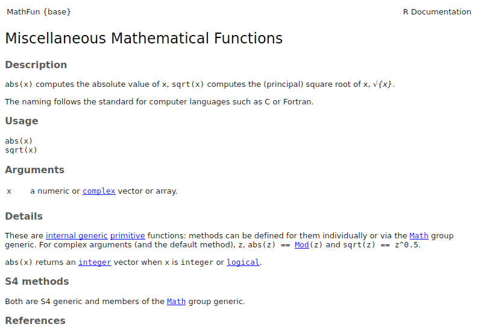

### Always always always first specify `options(stringsAsFactors = FALSE)`
Make sure to always run this command when you start using R:
```{r}
options(stringsAsFactors = FALSE)
```

We'll cover what this is in a later practical, but for now it's important to specify the `stringsAsFactors` option whenever running code as you may get confusing results without it.  In short, [R assumes that your data contains factors or categorical variables](http://www.stat.berkeley.edu/classes/s133/factors.html), which isn't necessarily the case.

## Cheat sheets

**These sheets are important and summarize much of what you will need to know about R for this course**

* [R Cheat Sheet](https://www.rstudio.com/wp-content/uploads/2016/06/r-cheat-sheet.pdf) - this covers many of the basics of using R that you will need to know.
* [Data Visualization with ggplot2 Cheat Sheet](https://www.rstudio.com/wp-content/uploads/2015/03/ggplot2-cheatsheet.pdf) - this covers all the types of visualizations that can be done with `ggplot2`
* [Data Wrangling with dplyr and tidyr Cheat Sheet](https://www.rstudio.com/wp-content/uploads/2015/02/data-wrangling-cheatsheet.pdf) - this shows how you can use `dplyr` for reshaping, combining, grouping, and summarizing data frames.  We will cover `dplyr` in a later practical.

Only show R and ggplot cheatsheet

<center>
<table>
<tr>
<td style="text-align:center"><b>R cheat sheet</b></td>
<td style="width:50px"></td>
<td style="text-align:center"><b>ggplot2 cheat sheet</b></td>
<td style="width:50px"></td>
<td style="text-align:center"><b>dplyr cheat sheet</b></td>
</tr>

<tr>
<td><a href="https://www.rstudio.com/wp-content/uploads/2016/06/r-cheat-sheet.pdf">
</a></td>
<td style="width:50px"></td>
<td><a href="https://www.rstudio.com/wp-content/uploads/2015/03/ggplot2-cheatsheet.pdf"></a></td>
<td style="width:50px"></td>
<td><a href="https://www.rstudio.com/wp-content/uploads/2015/02/data-wrangling-cheatsheet.pdf"></a></td>
</tr>
</table>
</center>


## Finding help

In order to find help for how to use an R function, in the console, you can just type `?` followed by the name of the function.  For example, to find out how to use the `sum()` function, just type:

```{r}
?sum
```

You'll note that this will bring up the help page in the bottom right quadrant of RStudio.

If you want to find help for a function that doesn't start with a letter, you have to first surround it with single quotes.  for this example, we want to find information about how to use the `:` operator which allows us to create sequences via commands like `3:7`

```{r}
?':'
```

There is also a search box in the `Help` tab of RStudio, and there are numerous examples online of how to use R commands.

### Exercise
Locate the help pages for `abs` and `%%`

In the `Help` window you should see:

<center>
<table>
<tr>
<td></td>
<td style="width:100px"></td>
<td></td>
</tr>
</table>
</center>

## Reference Materials
For further information beyond what is covered in this practical, you can refer to the resources below.  If you are having trouble understanding the contents of the practical, these can be quite useful.

### Cheat sheets

**Much of what has been covered in this practical is available for easy reference in the [Base R Cheat Sheet](https://www.rstudio.com/wp-content/uploads/2016/06/r-cheat-sheet.pdf).**  It is highly recommended that you keep a copy of this handy when using R.

<a href="https://www.rstudio.com/wp-content/uploads/2016/06/r-cheat-sheet.pdf">
</a>

### Additional Materials

* [How to Transition from Excel to R](https://districtdatalabs.silvrback.com/intro-to-r-for-microsoft-excel-users)
* [R for Excel Users](http://www.rforexcelusers.com/)
* [Quick-R](http://www.statmethods.net/index.html)

For a more basic step-by-step introduction, you can install the [swirl](http://swirlstats.com/students.html) package:
```{r, eval=FALSE}
install.packages("swirl")
```

You can then work through tutorials by doing:
```{r, eval=FALSE}
library(swirl)
swirl()
```

Swirl is interesting since it guides you in learning R, within the R console.  You'll see examples like this:
```{eval=FALSE}
| To assign the result of 5 + 7 to a new variable called x, you type x <- 5 +
| 7. This can be read as 'x gets 5 plus 7'. Give it a try now.
```


```{r}
times_true_mean_in_confidence_interval = 0
num_tests = 500
# create a loop where the value of "count" will be 1, 2, 3... num_tests
for (count in c(1:num_tests)){
  
  # sample random values from the distribution
  vals = rnorm(n, mean=0, sd=1)
  
  # calculate mean and standard deviation
  mean_pts = mean(vals)
  sd_pts = sd(vals)
  
  # calculate left and right sides of the 95% confidence interval
  left = mean_pts - (1.96 * sd_pts/sqrt(n))
  right = mean_pts + (1.96 * sd_pts/sqrt(n))
  
  # see if the true_mean is within the bounds of the interval
  if (true_mean >= left & true_mean <= right){
    # if it's in the interval, add one to this variable
    times_true_mean_in_confidence_interval = times_true_mean_in_confidence_interval + 1
  }
}

# show how many times the true_mean falls within the intervals calculated
times_true_mean_in_confidence_interval

# what percentage of the time does the true_mean fall within the intervals calculated?
times_true_mean_in_confidence_interval / num_tests
```

What if we ran this 10,000 times?  How would this percentage change as we repeatedly took more random samples?

Note that the x axis is scaled logarithmically.

```{r, echo=FALSE}
times_true_mean_in_confidence_interval = 0

set.seed(1234)

num_tests = 10000
percent_times_true_mean_in_interval = c()
## create a loop where the value of "count" will be 1, 2, 3... num_tests
for (count in c(1:num_tests)){
  
  # sample random values from the distribution
  vals = rnorm(n, mean=0, sd=1)
  
  # calculate mean and standard deviation
  mean_pts = mean(vals)
  sd_pts = sd(vals)
  
  # calculate left and right sides of the interval
  left = mean_pts - (1.96 * sd_pts/sqrt(n))
  right = mean_pts + (1.96 * sd_pts/sqrt(n))
  
  # see if the true_mean is within the bounds of the interval
  if (true_mean >= left & true_mean <= right){
    # if it's in the interval, add one to this variable
    times_true_mean_in_confidence_interval = times_true_mean_in_confidence_interval + 1
  }
  
  percent_times_true_mean_in_interval = c(percent_times_true_mean_in_interval,
                                          (times_true_mean_in_confidence_interval/count))
}

data = data.frame(percent = percent_times_true_mean_in_interval,
                  iteration = c(1:num_tests))
ggplot(data, aes(x=iteration, y=percent)) + geom_point() + geom_line() +  
  xlab("Iteration") + 
  ylab("Percent times true mean in 95% confidence interval") + scale_x_log10()
```

This shows that there is a lot of variation at first, but as expected, with more samples, we settle into the 95% range.
