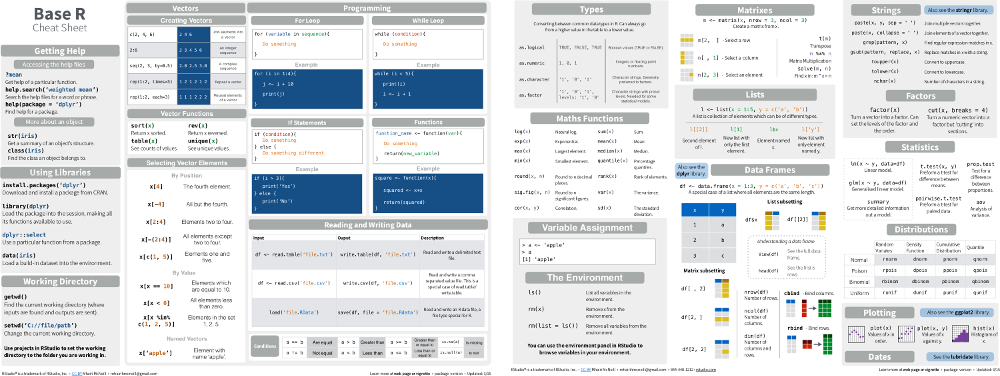

### Always always always first specify `options(stringsAsFactors = FALSE)`
Make sure to always run this command when you start using R:
```{r}
options(stringsAsFactors = FALSE)
```

We'll cover what this is in a later practical, but for now it's important to specify the `stringsAsFactors` option whenever running code as you may get confusing results without it.  In short, [R assumes that your data contains factors or categorical variables](http://www.stat.berkeley.edu/classes/s133/factors.html), which isn't necessarily the case.

## Cheat sheets

**These sheets are important and summarize much of what you will need to know about R for this course**

* [R Cheat Sheet](https://www.rstudio.com/wp-content/uploads/2016/06/r-cheat-sheet.pdf) - this covers many of the basics of using R that you will need to know.
* [Data Visualization with ggplot2 Cheat Sheet](https://www.rstudio.com/wp-content/uploads/2015/03/ggplot2-cheatsheet.pdf) - this covers all the types of visualizations that can be done with `ggplot2`
* [Data Wrangling with dplyr and tidyr Cheat Sheet](https://www.rstudio.com/wp-content/uploads/2015/02/data-wrangling-cheatsheet.pdf) - this shows how you can use `dplyr` for reshaping, combining, grouping, and summarizing data frames.  We will cover `dplyr` in a later practical.

Only show R and ggplot cheatsheet

<center>
<table>
<tr>
<td style="text-align:center"><b>R cheat sheet</b></td>
<td style="width:50px"></td>
<td style="text-align:center"><b>ggplot2 cheat sheet</b></td>
<td style="width:50px"></td>
<td style="text-align:center"><b>dplyr cheat sheet</b></td>
</tr>

<tr>
<td><a href="https://www.rstudio.com/wp-content/uploads/2016/06/r-cheat-sheet.pdf">
</a></td>
<td style="width:50px"></td>
<td><a href="https://www.rstudio.com/wp-content/uploads/2015/03/ggplot2-cheatsheet.pdf"></a></td>
<td style="width:50px"></td>
<td><a href="https://www.rstudio.com/wp-content/uploads/2015/02/data-wrangling-cheatsheet.pdf"></a></td>
</tr>
</table>
</center>


## Finding help

In order to find help for how to use an R function, in the console, you can just type `?` followed by the name of the function.  For example, to find out how to use the `sum()` function, just type:

```{r}
?sum
```

You'll note that this will bring up the help page in the bottom right quadrant of RStudio.

If you want to find help for a function that doesn't start with a letter, you have to first surround it with single quotes.  for this example, we want to find information about how to use the `:` operator which allows us to create sequences via commands like `3:7`

```{r}
?':'
```

There is also a search box in the `Help` tab of RStudio, and there are numerous examples online of how to use R commands.

### Exercise
Locate the help pages for `abs` and `%%`

In the `Help` window you should see:

<center>
<table>
<tr>
<td></td>
<td style="width:100px"></td>
<td></td>
</tr>
</table>
</center>

## Reference Materials
For further information beyond what is covered in this practical, you can refer to the resources below.  If you are having trouble understanding the contents of the practical, these can be quite useful.

### Cheat sheets

**Much of what has been covered in this practical is available for easy reference in the [Base R Cheat Sheet](https://www.rstudio.com/wp-content/uploads/2016/06/r-cheat-sheet.pdf).**  It is highly recommended that you keep a copy of this handy when using R.

<a href="https://www.rstudio.com/wp-content/uploads/2016/06/r-cheat-sheet.pdf">
</a>

### Additional Materials

* [How to Transition from Excel to R](https://districtdatalabs.silvrback.com/intro-to-r-for-microsoft-excel-users)
* [R for Excel Users](http://www.rforexcelusers.com/)
* [Quick-R](http://www.statmethods.net/index.html)

For a more basic step-by-step introduction, you can install the [swirl](http://swirlstats.com/students.html) package:
```{r, eval=FALSE}
install.packages("swirl")
```

You can then work through tutorials by doing:
```{r, eval=FALSE}
library(swirl)
swirl()
```

Swirl is interesting since it guides you in learning R, within the R console.  You'll see examples like this:
```{eval=FALSE}
| To assign the result of 5 + 7 to a new variable called x, you type x <- 5 +
| 7. This can be read as 'x gets 5 plus 7'. Give it a try now.
```


```{r}
times_true_mean_in_confidence_interval = 0
num_tests = 500
# create a loop where the value of "count" will be 1, 2, 3... num_tests
for (count in c(1:num_tests)){
  
  # sample random values from the distribution
  vals = rnorm(n, mean=0, sd=1)
  
  # calculate mean and standard deviation
  mean_pts = mean(vals)
  sd_pts = sd(vals)
  
  # calculate left and right sides of the 95% confidence interval
  left = mean_pts - (1.96 * sd_pts/sqrt(n))
  right = mean_pts + (1.96 * sd_pts/sqrt(n))
  
  # see if the true_mean is within the bounds of the interval
  if (true_mean >= left & true_mean <= right){
    # if it's in the interval, add one to this variable
    times_true_mean_in_confidence_interval = times_true_mean_in_confidence_interval + 1
  }
}

# show how many times the true_mean falls within the intervals calculated
times_true_mean_in_confidence_interval

# what percentage of the time does the true_mean fall within the intervals calculated?
times_true_mean_in_confidence_interval / num_tests
```

What if we ran this 10,000 times?  How would this percentage change as we repeatedly took more random samples?

Note that the x axis is scaled logarithmically.

```{r, echo=FALSE}
times_true_mean_in_confidence_interval = 0

set.seed(1234)

num_tests = 10000
percent_times_true_mean_in_interval = c()
## create a loop where the value of "count" will be 1, 2, 3... num_tests
for (count in c(1:num_tests)){
  
  # sample random values from the distribution
  vals = rnorm(n, mean=0, sd=1)
  
  # calculate mean and standard deviation
  mean_pts = mean(vals)
  sd_pts = sd(vals)
  
  # calculate left and right sides of the interval
  left = mean_pts - (1.96 * sd_pts/sqrt(n))
  right = mean_pts + (1.96 * sd_pts/sqrt(n))
  
  # see if the true_mean is within the bounds of the interval
  if (true_mean >= left & true_mean <= right){
    # if it's in the interval, add one to this variable
    times_true_mean_in_confidence_interval = times_true_mean_in_confidence_interval + 1
  }
  
  percent_times_true_mean_in_interval = c(percent_times_true_mean_in_interval,
                                          (times_true_mean_in_confidence_interval/count))
}

data = data.frame(percent = percent_times_true_mean_in_interval,
                  iteration = c(1:num_tests))
ggplot(data, aes(x=iteration, y=percent)) + geom_point() + geom_line() +  
  xlab("Iteration") + 
  ylab("Percent times true mean in 95% confidence interval") + scale_x_log10()
```

This shows that there is a lot of variation at first, but as expected, with more samples, we settle into the 95% range.


## Q-Q Plots

### Overview

A [Q-Q plot](https://en.wikipedia.org/wiki/Q%E2%80%93Q_plot) (or Quantile-Quantile plot) can be used to see if the values in a sample are normally distributed.  

Suppose you have a sample of values from an unknown population.  In the example below, we're actually sampling from a normal distribution, but pretend for now that we don't know where the data is from.  

```{r}
x = rnorm(50)
x
```

First you order the sample values from the lowest to the highest values.  We can use the `sort()` function for this:
```{r}
x = sort(x)
x
```

You can assign a "cumulative probability" $P_i$ to each measurement with $P_i = \frac{(i - 0.5)}{n}$.  

```{r}
i = seq_along(x)   # creates a sequence of 1, 2, ... up to the length of x (50 in this example)
P = (i - 0.5) / length(x)  # vector of values for each P_i
P
```

$x_i$ has then at least a fraction of $P_i$ data values smaller than $x_i$.

$x_i(P_i)$  is the $P_{i}$-th quantile of the sample.

As an example of this, our 10th element is:
```{r}
x[10]
```

and at the 10th location, our value for P is 
```{r}
P[10]
```

This means that at least `r P[10]*100`% of the values in the data set are smaller than `r x[10]`

We then create a new variable `z` where we find the locations of the quantiles specified in `P`
```{r}
z = qnorm(P, mean = mean(x), sd=sd(x))
```

We then plot `z` versus `x`.  If the line is straight, then the data appears to be normally distributed
```{r}
plot(z,x)
```

In R we can automatically perform all these steps just by using `qqnorm()` and `qqline()`.  

The function `qqnorm()` draws the points in the scatter plot, and `qqline()` draws the line showing where we would expect the points to lie if they are normally distributed.
```{r}
qqnorm(x)
qqline(x)   
```

Even with a low number of samples, many of the points are on the diagonal line, which indicates that our data (which is actually sampled from a normal distribution) looks like it could be normally distributed.

What is we try 500 samples instead of just 50?

```{r}
x <- rnorm(500)
qqnorm(x)
qqline(x)
```

What about 10000 samples?

```{r}
x <- rnorm(10000)
qqnorm(x)
qqline(x)
```

How does a uniform distribution look?

```{r}
x <- runif(100) # 100 samples from a uniform distribution
qqnorm(x)
qqline(x)
```

#### Using Q-Q plots on a binomial distribution

Type `?rbinom` into the console will bring up a page showing the following parameters that need to be specified to generate random numbers from a binomial distribution:

* `n`: number of observations
* `size`: number of trials
* `prob`: probability of success on each trial

In the code below, `n=1000` means that we have 1000 observations.  During each observation we do 50 trials (`size=50`) where the probability of a success is defined by `prob=0.5`.

```{r}
x <- rbinom(n=1000, size=50, prob=0.5)
```

We can use `range` to see the minimum and maximum values:
```{r}
range(x)
```

In other words, there exists at least one observation where there were `r min(x)` successes and at least one observation where there were `r max(x)` successes.

We use `+ xlim(c(0,50))` to show the x axis for values from 0 to 50.

```{r}
# Create a data frame for the values of x
# This results in a data frame with one column: data$x
data = as.data.frame(x)
ggplot(data, aes(x=x)) +  geom_histogram(binwidth = 1) + xlim(c(0,50))
```

Create a Q-Q plot for the data.  Note that the horizontal lines are because the samples from the binomial distribution are integer values.

```{r}
qqnorm(x)
qqline(x)
```

If we try a more skewed distribution with `prob=0.9`, we get:
```{r}
x <- rbinom(n=1000, size=50, prob=0.9)
data = as.data.frame(x)
ggplot(data, aes(x=x)) +  geom_histogram(binwidth = 1) + xlim(c(0,50))

qqnorm(x)
qqline(x)
```

## Q-Q Plots Exercise

We next use the `faithful` data set which is included with R.  You can type `?faithful` in the RStudio console to get more information on it.  This data is about the [Old Faithful geyser](https://en.wikipedia.org/wiki/Old_Faithful) in Yellowstone National Park in the US.  This geyser is famous for erupting on a very regular schedule and the data set has information on how long the eruptions are (`faithful$eruptions`) and the amount of time until the next eruption (`faithful$waiting`).

Make a Q-Q plot of the waiting times (`faithful$waiting`):

```{r, echo=FALSE}
x = faithful$waiting
qqnorm(x)
qqline(x)
```

This tells us that the eruptions are clearly not normally distributed.  To investigate further, create a histogram of the values:

```{r, echo=FALSE}
ggplot(faithful, aes(x=waiting)) + geom_histogram(binwidth=2)
```

From the histogram, we see from this is that it's clearly bi-modal as there are two distinct peaks.

To investigate further, create a scatter plot showing how the waiting time might be related to the length of the eruption.

```{r, echo=FALSE}
ggplot(faithful, aes(x=eruptions, y=waiting)) + geom_point() + 
  xlab("Length of eruption (minutes)") + 
  ylab("Waiting time until next eruption (minutes)")
```

We see a few things here:

* The longer the eruption, the longer we will have to wait until the next one.  
* There seem to be two distinct clusters.  It's not clear what is causing this, and since the data doesn't mention the date of the eruption, we don't know it randomly switches between short and long eruptions, or if for years there were long eruptions, but now there are only short eruptions due to factors such as earthquakes changing the water supply to the geyser.

We should split up the data into two sets, where one lists all the eruptions that lasted less than three minutes, and the other one contains those which are longer.

Now create two separate data frames from the `faithful` data frame, where `faithful_short` has eruptions < 3 and `faithful_long` has eruptions >= 3

```{r, echo=FALSE}
faithful_short = faithful %>% filter(eruptions < 3)
faithful_long = faithful %>% filter(eruptions >= 3)
```

Create a Q-Q plot for the short eruptions:
```{r, echo=FALSE}
qqnorm(faithful_short$waiting)
qqline(faithful_short$waiting)
```

Create a Q-Q plot for the long eruptions:
```{r, echo=FALSE}
qqnorm(faithful_long$waiting)
qqline(faithful_long$waiting)
```

If we split the data into two clusters, do they seem to be normally distributed?

## Exercises

Try what you have learned above on the examples discussed in the lecture.  Using R, you should arrive at the same numbers that were presented in class.

### Exercise 1

The government says that 26% of the populations smoke.  You want to test this by asking 30 of your friends. 

* If this sample is a good representation of the population, how many do you expect to smoke if the government says the truth?
* Because of the small sample you decide that if 6, 7, 8, or 9 smoke, you believe the government, otherwise you reject – is this a good choice?
* What about trusting the government if 4 – 11 people in the sample smoke

### Exercise 2

A large detector is set up to detect neutrinos. It usually counts 2/day. 

* What is the distribution you would use to estimate the probability of counting x neutrinos in a given day?
* What is the probability of detecting 8/day? Are scientists justified in calling this a special event?
* What if it counts 4/day?


## Power of the test 
You can perform power calculations for t tests via the `power.t.test` function.  If you type `?power.t.test` into the console you should see the following usage documentation:

```{r, eval=FALSE}
power.t.test(n = NULL, delta = NULL, sd = 1, sig.level = 0.05,
             power = NULL,
             type = c("two.sample", "one.sample", "paired"),
             alternative = c("two.sided", "one.sided"),
             strict = FALSE, tol = .Machine$double.eps^0.25)

```
To explain the parameters:

* `delta` parameter is the true difference between the null hypothesis and the alternative hypothesis.
* `n` is the sample size
* `sd` is the estimated standard deviation of the population
* `sig.level` is the significance level that you choose, e.g. 0.05, (Type I error probability)
* `power` is the power of test (1 - Type II error probability)
* `alternative` - `two.sided` or `one.sided`
* `type` we will only do this for the `one.sample`

We can now explore the different alternative hypotheses using this function.  Make sure to always fill in the `sig.level` and `sd`.  For `n`, `delta` and `power`, you have to fill in two of them and the test will calculate the remaining one.  If you know sample size (`n`), and the `sig.level`, it will give you the `power` of your test.  If know the `power` you want, then this will give you the sample size to achieve this power.

### Exercise
From previous research we know that the average life span of a certain species of parrot in their native habitat is 28.0 years, with a standard deviation of 5 years.  
 
A researcher studies a sample of 20 parrots in a new habitat. Assuming the standard deviation does not change, what is the chance that we can detect an increase in lifetime of 2 years compared to the old habitat at the 95% confidence level? 

On your own, explore different hypotheses where the alternative mean is from 29 to 33, then plot the power of the test as a function as each alternative hypothesis.

You should see:

```{r, echo=FALSE}
x0 = 28
xa = seq(28.5, 33, by = 0.5)
n = 20

sigma = 5
alpha = 0.05

# calculate difference between the means
diff = xa - x0

delta = abs(x0-xa)/sigma*sqrt(n)

res = power.t.test(delta = diff, sd = sigma, sig.level = alpha, n = n, 
                   type = "one.sample", alt = "one.sided")

beta1 = 1 - res$power

# create a data frame showing for different values of xa the power of the t test
df = data.frame(xa, power = res$power)

ggplot(df, aes(x=xa, y=power)) + 
  geom_point() + 
  ggtitle("n = 20")

```

Now, assuming that mu_a is 30, we can show the power as a function of sample size:

```{r}
xa = 30
diff = xa - x0
n = c(2:100)
res = power.t.test(delta = diff, sd = sigma, sig.level = alpha, n = n, 
                   type = "one.sample", alt = "one.sided")

beta1 = 1 - res$power

# create a data frame showing for different values of xa the power of the t test
df = data.frame(n, power = res$power)

ggplot(df, aes(x=n, y=power)) + 
  geom_point() + 
  ggtitle("Power vs. Sample Size")

```


### Exercise
Now assuming a power of 0.9 and mu_a = 30, then find the sample size to achieve this power of the test.

You should get:

```{r, echo=FALSE}
xa = 30
diff = xa - x0
power = 0.9
n = 20
res = power.t.test(delta = diff, sd = sigma, sig.level = alpha, power=power, 
                   type = "one.sample", alt = "one.sided")
res
```


