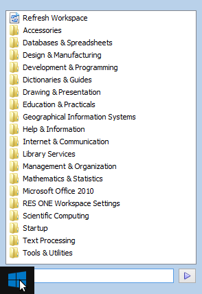
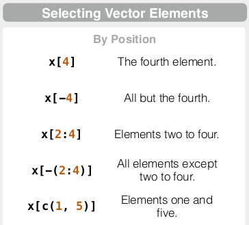

# {.tabset .tabset-fade .tabset-pills}

```{r, echo=FALSE, warning=FALSE, message=FALSE}
options(stringsAsFactors = FALSE)
library(knitr)
```

## What/Why?

[R is a language and environment for statistical computing and graphics.](https://www.r-project.org/about.html).  In more practical terms:

* It's a **digital swiss army knife**
    * It allows you to do very diverse things with data.
* It's **free** - just download and get started, no license, no trial period
* There's a **huge community** behind it
    * For even the weirdest problems you run into, you can Google it and usually find a solution (probably on [stackoverflow](http://stackoverflow.com/questions/tagged/r)). 
* You don't have write to code that others have already created (stand on the shoulders of giants)
    * There are over **[11,000 contributed packages covering a variety of topics](https://cran.r-project.org/web/views/)**. This means that for a lot of different applications and scientific domains, someone has already created something that you can re-use. This minimizes the amount of work you have to do, while allowing you to do much more sophisticated analysis.
    * **Package management** - you don't have to copy/paste this code. It's managed so that you just have to call the name of the package. You can also have R update every single package that you have installed, in order to get the latest bug fixes, enhancements, etc. 
* It lets you create **repeatable workflows**
    * Have new data? Just run the code again to generate plots + images for reports
* Use of **open source & open standards**
    * Researchers can inspect the source code and report errors to the developers, meaning that the process of finding and fixing bugs in the software is more transparent and efficient.
    * Open standards allow for data portability between a variety of programs, so you're not limited to just using proprietary programs. This can give you greater flexibility in the types of tools you use.

You're already used to programming since **[spreadsheets are code](http://www.slideshare.net/Felienne/spreadsheets-are-code-online)**:

```{Excel}
=SUM(OFFSET($data.$A$1,MATCH($T197,$data.$C$1:$C$1048576,0)-1,MATCH($AL$7&$AL$6,$data.$A$1:$AMJ$1,0)-29,1,2))/1000+SUM(OFFSET($data.$A$1,MATCH($T197,$data.$C$1:$C$1048576,0)-1,RIGHT(V$53,2)*8-7,1,2))/1000-SUM(OFFSET($data.$A$1,MATCH($T197,$data.$C$1:$C$1048576,0)-1,MATCH($AL$7&$AL$6,$data.$A$1:$AMJ$1,0)-37,1,2))/1000
```

This is a formula from an actual spreadsheet in use by a company.  This code is a nightmare to maintain and it's very difficult to check if there are any errors in it.  Spreadsheets create a soup of data storage, processing and presentation (i.e. numbers, formulas and graphs).  This hinders transparency and as spreadsheets get more complex, it becomes very difficult to trace how the data analysis is actually done.  With R, it's possible to use code to read from data files and then **[automatically generate reports in the form of Word documents, pdfs, or html pages](http://rmarkdown.rstudio.com/)**. Separating your data, processing and presentation of results into separate components will help you to stay organized.

## Setting up R and RStudio

You need to have both R and RStudio set up.  You can use R without RStudio, but if you do, the interface will look like the one on the left image below, and this can be a bit intimidating.  RStudio runs on top of R and provides a more visual interface, in addition to greatly assisting you with various aspects of programming.

<center>
<table>
<tr>
<th><h3>R</h3></td>
<th></td>
<th><h3>R + RStudio</h3></td>
<tr>
<td></a></td>
<td style="width:100px"><center><b><h3>vs.</h3></b></center></td>
<td></a></td>
</tr>
</table>
</center>

### University Computer

* **You do not have to install R or RStudio on the university computers.**  
* On the university computers you should be able to find RStudio in the Start Menu by looking for `Mathematics & Statistics` -> `R`.  
    * If you cannot find it there, then just search for "R studio" (make sure to include a space between "R" and "studio").
    * If there are several versions, just pick the one with the highest version number.  
    * In the example below, you can see that "R Studio 1.0.153" was the latest version that was found.  
* **Don't run "R for Windows"**.  This will give you a less user friendly interface that what is available with RStudio.

<center>
<table>
<tr>
<td></td>
<td style="width:100px"></td>
<td></td>
</tr>
</table>
</center>


### Personal Computer
On your own computer you will have to **install both R and RStudio**

* Download and install R for either [Windows](https://cran.r-project.org/bin/windows/base/), [Mac OS X](https://cran.r-project.org/bin/macosx/) or [Linux](http://www.jason-french.com/blog/2013/03/11/installing-r-in-linux/)
* [Download and install RStudio](https://www.rstudio.com/products/rstudio/download/)

### Open RStudio

Once you open up RStudio, you'll see that it has four panels, which are:

<table><tr><td>
**Console** - *Bottom Left*

* R commands can be run directly here

**Environment/History** - *Top Right*

* This shows all the variables and functions that are currently loaded in the workspace (the "**Environment**")
* You can click on the variables to see their values, which can be useful to inspect how the code is operating.
* The **History** shows all of the commands that you have run.

**R Script Files** - *Top Left*

* While you can run R code directly in the console, you can also save the code in a script file that allows you to rerun the code at a later date.  
* You can run lines of code by highlighting them, and then clicking on `Run` above.
* You can run all the code at once by doing `Code` -> `Run Region` -> `Run All`

**Files/Plots/Packages/Help** - *Bottom Right*

* **Files** - This shows everything in your current working directory
* **Plots** - Once you start plotting, multiple plots will be stored here.  There are arrows in this view that allow you to navigate  between multiple plots
* **Packages** - Shows all the packages installed and currently loaded
* **Help** - Shows documentation for various functions.  

</td>
<td valign="top">

</td>
</tr></table>

## How to read this tutorial

### Running Code Examples
Everything shown in the large gray boxes below is code that you can run by copy/pasting into the `Console` tab in RStudio. For example:

```{r}
print("hello world")
```

### Comments

You may also see comments included in the code, as indicated by text following the `#` sign
```{r}
# This is a comment, R doesn't do anything with this
```

These comments can also be placed at the end of a line of R code
```{r}
a <- "R will assign this text to a" # This is a comment, R doesn't do anything with this
```

For your own work, it is generally a good idea to include comments to help other people understand your code, and they can also be useful for yourself if you haven't looked at a piece of code in a long time.

### Saving code in an R Script

You can also collect these statements in a new R file (`File` -> `New File` -> `R Script`) which you can then run.

If you do create a new R file, you can run the code by selecting one of the options under the `Run` button:
<center></center>

Gray bits of text `like this` usually refer to individual R commands, package names, or the exact name of things that you will see in the user interface.

### Exercises

For sections labelled **Exercise** we only show the results of the code and not the code itself.  You should check to make sure that you get the same answers.

## Basic Operations

### Using R as a calculator

You can use R just as you would use a calculator, for example, to add two numbers:

```{r}
3 + 2
```

### Assinging values to variables.

We can assign the results of the calculation `3 + 2` to a variable named `a` by using `<-`
```{r}
a <- 3 + 2
```

Note that in R you can also just use `=` to assign the result.  You often will see people use both forms of these.
```{r}
a = 3 + 2
```

Now print out the value of `a`:
```{r}
a
```

You can also do the same with the `print` function:
```{r}
print(a)
```

Although you assigned a number to the variable `a`, you can also assign to it different types of data like text:
```{r}
a = "this is some text"
a
```

### Exercise

Assign the result of five times three to a variable named `b` and print out the resulting value
```{r, echo=FALSE}
b <- 5 * 3
b
```

Assign the result of `b` divided by 10 to a new variable `c` and print out the results using `print(c)`
```{r, echo=FALSE}
c <- b / 10
print(c)
```


## Vectors

### Creating Vectors

We can also assign a list of values to variables, instead of just a single value.  Below we use the `c()` function which means to concatenate or combine.

```{r}
a <- c(3, 7, 1, 6)
a
```
Note that when we print out the results, the commas are replaced by spaces.

### Modifying Vectors
We can also use `c()` to add values to the beginning or end.  Below we add `10` to the beginning and `21` to the end.
```{r}
a <- c(10, a)
a
a <- c(a, 21)
a
```

We can also concatenate two vectors together:
```{r}
b <- c(9, 2, 5)
c <- c(a, b)
c
```

Note that here we have a variable named `c` and we also use the function `c()`.  R is able to understand that by this syntax we mean two different things.

### Operations on Vectors

With vectors you can do element-wise operations.  Below we divide each element of `c` by `10`.

```{r}
c / 10
```

We can divide one vector by another:
```{r}
a <- c(10, 6)
b <- c(2, 5)
a / b
```

This result is equivalent to `c(10/2, 6/5)`, in other words, dividing the first element of `a` by the first element of `b` and then dividing the second element of `a` by the second element of `b`

If we divide vectors that are not of the same length, then we get a bit of a strange result:
```{r}
a <- c(10, 6, 4)
b <- c(2, 5)
a / b 
```

Even though R gives us a result, we get a warning that the vectors are not of the same length.  What is happening here is that R will wrap around the shorter vector.  Behind the scenes, it's doing a calculation like `c(10/2, 6/5, 4/2)`.  Note that the `2` appears twice as it is the first element of `b`.

Above we divided the longer vector by the shorter vector.  Below we divide the shorter vector by the longer vector:

```{r}
b / a
```

Here the calculation being performed is `c(2/10, 5/6, 2/4)`.  Note that in both cases the resulting vector has three elements, meaning that the result always has the same number of elements as the longest vector.

### Subsetting Vectors

Sometimes we don't want to use the all the values in a vector, but only want certain values.  For the examples below we'll work with a vector of ten random values:
```{r}
x = c(-1, 0, 0, -9, 1, 4, 8, -2, 3, 5)
```

Get the third element of the vector:
```{r}
x[3]
```

Note that in R, indices start one, while in other languages they may start at zero.  In other words, in Python, `x[3]` would give you the fourth element in the vector.

Return everything except for the seventh element:
```{r}
x[-7]
```

Get the fifth, sixth and seventh element:
```{r}
x[5:7]
```

Return all elements except for the fifth, sixth and seventh element:
```{r}
x[-(5:7)]
```

Return elements at locations 5 and 7:
```{r}
x[c(5,7)]
```

Note that while `x[c(5:7)]` will give you the same results as `x[5:7]` i.e. you don't need to include the `c()`,  you will get an error if instead of `x[c(5,7)]`, you try `x[5,7]`
```{r, error=TRUE}
x[5,7]
```
The reason is that this is the syntax that is used to access elements of a matrix, specifically the element at row 5 and column 7.  We will discuss this later on in the practical.

Find all values equal to zero:
```{r}
x[x == 0]
```
Note that zero is listed twice as we have two zeros in the vector

Find all values less than four:
```{r}
x[x < 4]
```

Find all values in `x` which are in the set of numbers one through four:
```{r}
x[x %in% 1:4]
```
The values are returned in the order in which they are found, which is why the `4` appears before the `3`

## Sequences

In R you will often be creating vectors that contain sequences of numbers.  If you would like to create a vector for the sequence of integers from `3` to `7`, you can do:

```{r}
c(3, 4, 5, 6, 7)
```

However, you don't have to specify the intermediate numbers since we're just taking consecutive integers.  Using the `:` operator, we can shorten our code that looks like `start_number:end_number`

```{r}
3:7
```

You will also sometimes see people use `c()` to do this.  This also gives the same result.
```{r}
c(3:7)
```

Sequences can count down too
```{r}
7:3
```

It's possible to use this technique with real numbers and not just integers.  
```{r}
3.1459:10
```
Note that the final value is `9.1459` and not `10`.  This is because the next number in the sequence would be `10.1459` and this is greater than `10`.  In general, the final value in a sequence will be a value less than or equal to the end value you specified.

Yet another way to do this is via the `seq()` function
```{r}
seq(3, 7, by = 1)
```

What's special about this is the `by` argument which allows us to specify by which value we would like to increment the sequence
```{r}
seq(3, 7, by = 0.5)
```

Again, the final value will be less than or equal to the end value we request:
```{r}
seq(3, 7, by = 3.14159)
```

The `seq()` function can also calculate the increment needed in order to have a sequence of a specified length with certain start and end values.  In this case, we want a sequence with ten elements that starts with `3` and ends with `10`.
```{r}
seq(3, 7, length.out = 10)
```

### Repeating Sequences

Instead of creating sequences that increment by a fixed value, you may also want to create sequences of repeating elements.  R allows you to do this with the `rep()` function.

Just like with the `seq()` function, there are different arguments we can use to get different behaviour.  If we use the `times` argument, we can repeat a sequence multiple times like we would with `c(1:3, 1:3, 1:3, 1:3)`
```{r}
rep(1:3, times=4)
```

If we want to repeat each element in a vector multiple times in a row, then we can use the `each` argument.
```{r}
rep(1:3, each = 4)
```

You can even call `rep()` multiple times to generate very complex sequences
```{r}
rep(rep(1:3, times=2), each=2)
```

## Matrices

Initialize a matrix of zeros with three columns and two rows.  
```{r}
b = matrix(0, ncol=3, nrow=2)
b
```

Then set the value at row 1 and column 2 to `3`
```{r}
b[1,2] = 3
b
```

We can also convert a vector into a matrix
```{r}
matrix(1:6, ncol=3, nrow=2)
```
In the previous example, the vector had the same number of elements as the matrix.  We can also create a matrix where the vector is repeated.  Note how the values are repeated.

```{r}
matrix(1:3, ncol=3, nrow=2)
```

Note that you will get a warning of the length of the vector is not a sub-multiple or multiple of the number of rows in the matrix.  R will still recycle the elements though.
```{r}
matrix(1:5, ncol=3, nrow=2)
```

We can also control how R populates the matrix with vector values, by using the `byrow=TRUE` argument.  By default it will place vector values in a matrix by going down the columns from left to right.  

```{r}
matrix(1:6, ncol=3, nrow=2, byrow=TRUE)
```

You can append a matrix to the end of another matrix using `rbind` which means that you will bind the rows together.
```{r}
b = matrix(0, ncol=3, nrow=2)
c = matrix(1, ncol=3, nrow=2)
d = rbind(b,c)
d
```

You can also bind the columns together using `cbind`
```{r}
cbind(b,c)
```

R also has functions that run operations such as `mean` and `sum` on matrix rows and columns:
```{r}
rowMeans(d)
rowSums(d)
colMeans(d)
colSums(d)
```

### Subsetting Matrices


```{r}
a = matrix(1:12, nrow=3, ncol=4, byrow = TRUE)
a
```

We can subset elements of a matrix by using square brackets, similar to how we accessed elements of a vector.  

The main difference is that for matrices we need to specify first number corresponds to the row number, the second corresponds to the column number

Select values from row 2:
```{r}
a[2,]
```

Select values from column 2:
```{r}
a[,2]
```

Select element at row 1, column 2:
```{r}
a[1,2]
```

It's still possible to access matrix elements by a single index, although this is a bit dangerous as it's not always intuitive where the value is coming from.
```{r}
a[10]
```

Just like with vectors, we can still access elements that meet some condition
```{r}
a[a > 5]
```

## Data Frames

One issue with matrices is that it can only hold one type of data.  The example below shows what happens when you try to combine matrices with numbers and text:
```{r}
a = matrix(1:12, nrow=4, ncol=3)
a
b = matrix(c("this", "is", "some", "text"), nrow=4, ncol=1)
b
cbind(a,b)
```
What's happened is that by default R converted all the elements to text since it can't combine numbers and text together.  

A way around this is to use data frames.  A key difference from matrices is that data frames only require that you have a single data type *per column*.  In the example below, the first two columns are numbers, while the last column is text.  Note that when we specify `x =`, `y =` and `z = ` below, we actually creating a type of table where the columns will be labelled `x`, `y` and `z`.

```{r}
a = data.frame(x = c(1:3),
               y = c(4:6),
               z = c("a", "b", "c"))
a
```

Data frames are similar to matrices in that you can access elements based on their row and column indices.  For example, to get the element in the 2nd row and third column:
```{r}
a[2,3]
```

We can also get just the 2nd row:
```{r}
a[2,]
```

Or just the 3rd column:
```{r}
a[,3]
```

One of the nice things about data frames is that you can use the names of the columns (combined with the `$` sign) to directly access the values in that column.  So if we want to see the values of only the `z` column, we can use `a$z`

```{r}
a$z
```

Multiple columns can be selected.  Note that we have to include a comma to indicate that we want all rows
```{r}
a[,c("x", "y")]
```

Same, but rows two and three for columns `x` and `y`:
```{r}
a[2:3,c("x", "y")]
```

You can also add a new column to an existing data frame:
```{r}
a$t = c(10, 13, 17)
a
```

or remove an existing column:
```{r}
a$x <- NULL
a
```


We'll look at the `mtcars` data set that is included with R.  If you type `?mtcars` in the console, you'll see more documentation.  Looking at the first few lines of the `mtcars` data frame, we see the following which shows data in several columns: `mpg`, `cyl`, `disp`, `hp`, `drat`, `wt`, `qsec`, `vs`, `am`, `gear` and `carb`
```{r}
head(mtcars)
```

The `head` command just shows us the top few rows, and you can also use the `tail` command to look at the bottom rows.

For specific columns, we can use the `mean` and `sd` functions to find the average and standard deviation.
```{r}
mean(mtcars$mpg)
sd(mtcars$mpg)
```

### Other functions to maybe cover:

* nrow
* ncol
* dim
* summary
* head
* tail

## Reading CSV Files

The following example is based on [CO2 emissions data from the UNFCCC](http://unfccc.int/ghg_data/ghg_data_unfccc/time_series_annex_i/items/3814.php), specifically the ["CO2 excluding LULUCF" Excel spreadsheet](http://unfccc.int/files/ghg_emissions_data/application/x-zip-compressed/ai_co2_wolulucf.zip.zip) which we've transformed into a CSV file.

CSV stands for ["comma-separated values"](https://en.wikipedia.org/wiki/Comma-separated_values) which means that you represent tabular data by using commas to separate values from different columns:

```{csv}
animal,farm_count
chickens,20
cows,10
pigs,5
```

While you can technically read Excel files into R, reading CSV files is much much faster as it is a very simple data format.

Now we'll load in an example data file and create several plots with it.

For this, you'll need the UNFCCC_CO2_Emissions.csv file.  To get it, **right click** on this link: [UNFCCC_CO2_Emissions.csv](https://raw.githubusercontent.com/cbdavis/DASM/master/2017/data/UNFCCC_CO2_Emissions.csv) and select **"Save Target As"** or **"Save Link As"** to save it to your computer.

Internet Explorer might try to save this as "UNFCCC_CO2_Emissions.**txt**", make sure to save this as "UNFCCC_CO2_Emissions.**csv**" or adjust your code so that it knows to read the correct file.

One thing you need to check is your working directory. This is the directory where R looks for any files.  You can set this in RStudio `Session` -> `Set Working Directory` -> `Choose Directory`

<center></center>

Make sure that this is set to the directory where you have placed the `UNFCCC_CO2_Emissions.csv` file.

```{r, eval=FALSE}
df = read.csv(file="UNFCCC_CO2_Emissions.csv")
```

```{r, echo=FALSE}
df = read.csv(file="./data/UNFCCC_CO2_Emissions.csv")
```


## Finding help

```{r}
?sum
```

```{r}
?':'
```

### Exercise
Locate the help pages for `abs` and `%%`

In the `Help` window you should see:

<center>
<table>
<tr>
<td></td>
<td style="width:100px"></td>
<td></td>
</tr>
</table>
</center>


## Reference Materials
For further information beyond what is covered in this practical, you can refer to the resources below.  If you are having trouble understanding the contents of the practical, these can be quite useful.

### Cheat sheets

**These sheets are important and summarize much of what you will need to know about R for this course**

* [R Cheat Sheet](https://www.rstudio.com/wp-content/uploads/2016/06/r-cheat-sheet.pdf) - this covers many of the basics of using R that you will need to know.
* [Data Visualization with ggplot2 Cheat Sheet](https://www.rstudio.com/wp-content/uploads/2015/03/ggplot2-cheatsheet.pdf) - this covers all the types of visualizations that can be done with `ggplot2`
* [Data Wrangling with dplyr and tidyr Cheat Sheet](https://www.rstudio.com/wp-content/uploads/2015/02/data-wrangling-cheatsheet.pdf) - this shows how you can use `dplyr` for reshaping, combining, grouping, and summarizing data frames.  We will cover `dplyr` in a later practical.

<center>
<table>
<tr>
<td style="text-align:center"><b>R cheat sheet</b></td>
<td style="width:50px"></td>
<td style="text-align:center"><b>ggplot2 cheat sheet</b></td>
<td style="width:50px"></td>
<td style="text-align:center"><b>dplyr cheat sheet</b></td>
</tr>

<tr>
<td><a href="https://www.rstudio.com/wp-content/uploads/2016/06/r-cheat-sheet.pdf">
</a></td>
<td style="width:50px"></td>
<td><a href="https://www.rstudio.com/wp-content/uploads/2015/03/ggplot2-cheatsheet.pdf"></a></td>
<td style="width:50px"></td>
<td><a href="https://www.rstudio.com/wp-content/uploads/2015/02/data-wrangling-cheatsheet.pdf"></a></td>
</tr>
</table>
</center>


### Additional Materials

* [How to Transition from Excel to R](https://districtdatalabs.silvrback.com/intro-to-r-for-microsoft-excel-users)
* [R for Excel Users](http://www.rforexcelusers.com/)
* [Quick-R](http://www.statmethods.net/index.html)

For a more basic step-by-step introduction, you can install the [swirl](http://swirlstats.com/students.html) package:
```{r, eval=FALSE}
install.packages("swirl")
```

You can then work through tutorials by doing:
```{r, eval=FALSE}
library(swirl)
swirl()
```

Swirl is interesting since it guides you in learning R, within the R console.  You'll see examples like this:
```{eval=FALSE}
| To assign the result of 5 + 7 to a new variable called x, you type x <- 5 +
| 7. This can be read as 'x gets 5 plus 7'. Give it a try now.
```

## Maybe leave out

### Install Required Packages

Once R and RStudio is installed, **open up RStudio and install the necessary packages for R**.  Note that with R, the word "package" and "library" are often used interchangeably.  Today we'll need to install the [ggplot2](http://docs.ggplot2.org/current/) library to do the plotting.


#### Installation Steps

* In the bottom right quadrant of RStudio, locate the `Packages` tab, and click on `Install`:

<center></center>

* Then type in the name of the package `ggplot2`.  You should see it auto-complete as you type:

<center></center>

* Click on `Install` and make sure that `Install dependencies` is checked:

<center></center>

* You should then see statements like this in the console on the bottom left quadrant:

<center></center>

* As you can see in the console, you can also install packages just by typing:

```{r, eval=FALSE}
install.packages("swirl")
```

### Always always always first specify `options(stringsAsFactors = FALSE)`
Make sure to always run this command when you start using R:
```{r}
options(stringsAsFactors = FALSE)
```

We'll cover what this is in a later practical, but for now it's important to specify the `stringsAsFactors` option whenever running code as you may get confusing results without it.  In short, [R assumes that your data contains factors or categorical variables](http://www.stat.berkeley.edu/classes/s133/factors.html), which isn't necessarily the case.
