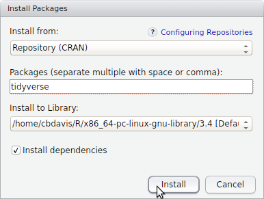

  
# Plotting in R {.tabset .tabset-fade .tabset-pills}

```{r, echo=FALSE, warning=FALSE, message=FALSE}
options(stringsAsFactors = FALSE)
library(knitr)
```

## Install packages

For this practical, we need to **open up RStudio and install the necessary packages for R**.  Note that with R, the terms "package" and "library" are often used interchangeably and they mean the same thing.  Today we'll need to install the [tidyverse](https://www.tidyverse.org/) package.

The Tidyverse package is a sort of "meta-package" that actually installs a collection of other packages which are very useful for working with R.  In other words, instead of installing ten different packages individually, you just install this one package and it grabs everything that you need.  The online book [R for Data Science](http://r4ds.had.co.nz/) goes into much more detail about how these packages can be used, and may be useful to refer to in the future, especially if your thesis project involves a lot of data analysis in R.

For this practical, there are two particular packages contained within Tidyverse that we will be using.

The first package is [`dplyr`](http://dplyr.tidyverse.org/), which makes it easy to do very complex operations with data frames.  The second is [`ggplot2`](http://docs.ggplot2.org/current/) which allows you to plot data using a variety of visualizations.

### Installation Steps

In the bottom right quadrant of RStudio, locate the `Packages` tab, and click on `Install`:

<center></center>&nbsp;<p>

Then type in the name of the package `tidyverse`.  You should see it auto-complete as you type:

<center></center>&nbsp;<p>

Click on `Install` and make sure that `Install dependencies` is checked:

<center></center>&nbsp;<p>

The installation may take a minute or two because of the number of different packages it has to install.  You should then see statements like this in the console on the bottom left quadrant:

<center></center>&nbsp;<p>

Once you see `package ‘tidyverse’ successfully unpacked and MD5 sums checked`, then things have been installed successfully.

You can also install packages just by typing:

```{r, eval=FALSE}
install.packages("tidyverse")
```

We first need to load the library that we'll be using for the rest of this tutorial:

```{r, message=FALSE}
library(tidyverse)
```

After running this command, you may see messages like this:
<center></center>
For this practical, these warnings are normal and won't cause a problem.

If later on you see an error that says something like `could not find function`, then that means that you forgot to load the library and that you need to make sure to run the `library(tidyverse)` command.

## Data Types

Use `class()` to see what type of data type you are working with

Converting between data types

`as.numeric()`
`as.factor()`
`as.data.frame()`

* boolean
* numeric
* character
* factor

TODO: show this as a data frame instead where certain factor values are repeated
```{r}
df = data.frame(person = c("Alice", "Bob", "Carol"),
                type_of_person = factor(c("doesn't like cheese", "likes cheese", "likes cheese")),
                favourite_number = c(4, 8, 9), 
                likes_cheese = c(FALSE, TRUE, TRUE))
```

Behind the scenes, factors are actually numbers.  You shouldn't use these numbers directly, R just uses them internally to perform some of its calculations quicker.
```{r}
as.numeric(df$type_of_person)
```

## Conditionals

!=
== is not the same as =
>
>=


## dplyr

set of verbs for performing operations on data frames

explain the `%>%` symbol

### Select

select particular columns

### Filter

logical operators

filter for cars in some list

```{r}
mtcars %>% filter(hp < 100)
```

We separate multiple conditions by a comma

```{r}
mtcars %>% filter(100 <= hp, hp < 200)
```

Note that the order of the conditional statements doesn't matter

instead of `hp < 200` like above we can also use `200 > hp`

```{r}
mtcars %>% filter(100 <= hp, 200 > hp)
```

We can also do filtering on values in multiple columns
```{r}
mtcars %>% filter(100 <= hp, 200 > hp, cyl == 8)
```


### Summarise

For all cars, find the average and standard deviation of all the horsepower (`hp`) values:

```{r}
mtcars %>% summarize(avg_hp = mean(hp), sd_hp = sd(hp))
```

Find the average fuel efficiency (`mpg` = "miles per gallon") for different ranges of horsepower (`hp`)

```{r}
mtcars %>% filter(hp < 100) %>% summarise(avg_mpg = mean(mpg))

mtcars %>% filter(100 <= hp, hp < 200) %>% summarise(avg_mpg = mean(mpg))

mtcars %>% filter(200 <= hp, hp < 300) %>% summarise(avg_mpg = mean(mpg))
```

### multiple verbs


## Reading CSV Files

The following example is based on [CO2 emissions data from the UNFCCC](http://unfccc.int/ghg_data/ghg_data_unfccc/time_series_annex_i/items/3814.php), specifically the ["CO2 excluding LULUCF" Excel spreadsheet](http://unfccc.int/files/ghg_emissions_data/application/x-zip-compressed/ai_co2_wolulucf.zip.zip) which we've transformed into a CSV file.

### What is CSV?

CSV stands for ["comma-separated values"](https://en.wikipedia.org/wiki/Comma-separated_values) which means that you represent tabular data by using commas to separate values from different columns:

```{csv}
animal,farm_count
chickens,20
cows,10
pigs,5
```

While you can technically read Excel files into R, reading CSV files is much much faster as it is a very simple data format.

### Saving the File to Your Computer

Now we'll load in an example data file. For this, you'll need the UNFCCC_CO2_Emissions.csv file.  To get it, **right click** on this link: [UNFCCC_CO2_Emissions.csv](https://raw.githubusercontent.com/cbdavis/DASM/master/2017/data/UNFCCC_CO2_Emissions.csv) and select **"Save Target As"** or **"Save Link As"** to save it to your computer.

Internet Explorer might try to save this as "UNFCCC_CO2_Emissions.**txt**", make sure to save this as "UNFCCC_CO2_Emissions.**csv**" or adjust your code so that it knows to read the correct file.

### Set Correct Working Directory

One thing you need to check is your working directory. This is the directory where R looks for any files.  You can set this in RStudio `Session` -> `Set Working Directory` -> `Choose Directory`

<center></center>

Make sure that this is set to the directory where you have placed the `UNFCCC_CO2_Emissions.csv` file.

### Read CSV File

```{r, eval=FALSE}
df <- read.csv(file="UNFCCC_CO2_Emissions.csv")
```

```{r, echo=FALSE}
df <- read.csv(file="./data/UNFCCC_CO2_Emissions.csv")
```

### Inspect Data

When you do this, you'll notice that the data frame `df` appears in the `Environment` tab, and we can see that it has 1012 rows (observations) and 3 variables (columns).
<center></center>

If you click this, you will be able to inspect the actual values in the data frame:
<center></center>

Use `summary` to get a quick overview of what is in the data:
```{r}
summary(df)
```
From this we see that it contains data on years from 1990 until 2012.

If you have read everything in correctly, you should get the following values for the average and standard deviation of the `CO2_Mt` column.

```{r}
mean(df$CO2_Mt)
sd(df$CO2_Mt)
```

Create line plots per country of the amount of CO2 emissions:
```{r EmissionsPerCountryLinePlot, fig.width=12, fig.height=6, cache=TRUE}
ggplot(df, aes(x=Year, y=CO2_Mt, colour=Country)) + geom_line()
```

Create a stacked area chart showing how each country's CO2 emissions contributes to the total:
```{r EmissionsPerCountryArea, fig.width=12, fig.height=6, cache=TRUE}
ggplot(df, 
       aes(x=Year, y=CO2_Mt, fill=Country)) + 
  geom_area()
```

Same plot, but using `geom_line(aes(ymax=CO2_Mt), position="stack", size=0.1)` to add black lines to help better distinguish the individual countries.

```{r EmissionsPerCountryAreaWithSeparatingLine, fig.width=12, fig.height=6, cache=TRUE}
ggplot(df, 
       aes(x=Year, y=CO2_Mt, fill=Country)) + 
  geom_area() + 
  geom_line(aes(ymax=CO2_Mt), position="stack", size=0.1)
```

In the previous plots, it's a bit difficult to distinguish countries with similar colors.  We can also use `facet_wrap` to create plots for individual countries.

* `~Country` - create individual plots per distinct values in the `Country` column.
* `scales="free_y"` - each plot will have its y axis scaled individually.  This helps to view the trends from countries with less CO2 emissions.

```{r EmissionsPerCountryFacetWrap, fig.width=12, fig.height=10, cache=TRUE}
ggplot(df, aes(x=Year, y=CO2_Mt)) + geom_line() + facet_wrap(~Country, scales="free_y")
```

The plot above shows the variation, but you'll notice that the minimum value on the y scale is not set to zero.  This means that the variation observed may not actually be that big when considering the overall amount of emissions.  To fix this, we update our code to use `ymin=0` so that we can get a picture of the absolute magnitude of emissions.

```{r EmissionsPerCountryFacetWrapYmin0, fig.width=12, fig.height=10, cache=TRUE}
ggplot(df, aes(x=Year, y=CO2_Mt, ymin=0)) + geom_line() + facet_wrap(~Country, scales="free_y")
```


## ggplot2 Basics

show with mtcars how to use 2 colors outside of the aes (just filter on different values)


Many visualizations created with R are often created using the **[ggplot2 library](http://ggplot2.org/)**.  What's interesting about this library is that way in which it allows you to construct visualizations.  The gg in ggplot2 stands for the Grammar of Graphics. The idea is that when you create plots, you are basically writing sentences that are of the form:
  
  `Here's my data frame` + `Here are the x and y columns` + `Apply this kind of plot to that data` + `These are the axis labels` + `here are some more additional transformations`

The syntax may look strange at first, although it’s a very modular approach, and you can create very complex visualizations just by adding new parts to these sentences.

We'll first start off by writing code that *doesn't work*, but it at least shows how we build up these statements.  First we have the `ggplot()` function.  You need to call this whenever you want to make a plot.

```{r, eval=FALSE}
ggplot()
```

Next we need to specify which data frame we want to use, via the `data=` argument.  In this case we use the `mtcars` data frame which we first showed in the previous practical.

```{r, eval=FALSE}
ggplot(data=mtcars)
```

At this point, ggplot knows that we want to plot a data frame, but it's not sure which columns it should look at.

We now have to use `aes()` to map what are called the aesthetics.  Here we tell ggplot which columns are to be used for the `x` and `y` values in the plot.  Note that we use don't use quotation marks for the column names, i.e. `aes(x=mpg, y=cyl)` is the correct syntax, while `aes(x="mpg", y="cyl")` will not give you the results that you want.
```{r}
ggplot(data=mtcars, aes(x=mpg, y=cyl))
```

Now we see a blank grid, whose ranges correspond to the min/max values of the `cyl` and `mpg` columns.  At this point ggplot knows *what* we want to plot, but not *how* to plot it.  To do this, we need to add one of the "Geoms" as referred to on the [Data Visualization with ggplot2 Cheat Sheet](https://www.rstudio.com/wp-content/uploads/2015/03/ggplot2-cheatsheet.pdf).  These are the functions which begin with `geom_` and look like `geom_point`, `geom_line`, `geom_boxplot`, etc.

`ggplot(data=` **your data frame** `, aes(x=` **column in your data frame** `, y=` **another column in your data frame** `)) + geom_` **point, line, etc.**


Show different places where the data frame can be specified - if mixing data frames, then need to leave ggplot() empty

Don't need to specify `ggplot(data=mtcars, ...` can just leave that blank and use `ggplot(mtcars, ...`

also if color, fill outside the aesthetics

difference between color and fill

ggplot - one variable vs. two variables

show equivalence
ggplot() + geom_point(data=
ggplot(data=) + geom_point()

if specify in ggplot(data= then don't have to specify it again

+ geom_point() + geom_line()

have a section on common problems (for inspiration check section 3 in Data Science for R, ggplot) - issues like you can break lines, but end of line has to be a '+'.  Also issue with color="red" matters where you put it in the aes

### Scatter plot
To understand this, we can first do a simple scatter plot.  You'll notice with the syntax that we first start with the `mtcars` data frame, then we specify which columns are to be associated with the `x` and `y` values, and then we specify that we want to plot the data as points by adding `+ geom_point()`.

```{r mtcarsGeomPoint, cache=TRUE}
ggplot(mtcars, aes(x=hp, y=mpg)) + geom_point()
```

Don't put the plus at the beginning of the line


In the following examples, you may see the code examples split over multiple lines.  The two statements below are actually equivalent, but by spreading the commands over multiple lines it can sometimes help to make things more readable by separating the code into its different functional pieces.

```{r, eval=FALSE}
ggplot(mtcars, aes(x=hp, y=mpg)) + geom_point()

ggplot(mtcars, 
       aes(x=hp, y=mpg)) + 
  geom_point()
```

We can also use values from other columns to modify particular attributes of the points.  For example, we can set the color of the points to indicate the number of cylinders
```{r mtCarsPointColor, cache=TRUE}
ggplot(mtcars, aes(x=hp, y=mpg, colour=cyl)) + geom_point()
```

We can set the size of the points based on the weight of the car
```{r mtCarsColorSizePoint, cache=TRUE}
ggplot(mtcars, aes(x=hp, y=mpg, colour=cyl, size=wt)) + geom_point()
```

show something where put the color outside the aes
also specify "red" within the aes - it's not really red then.  Where you put the color matters

### Boxplot

What happens when we don't use factor (show what goes wrong)

For this example, we need to specify `x=factor(cyl)` to make sure that there is a boxplot drawn for each unique value of `cyl`.

```{r mtCarsBoxPlot, cache=TRUE}
ggplot(mtcars, aes(x=factor(cyl), y=mpg)) + geom_boxplot()
```

### Histogram
Histogram of the number of cars with a particular fuel economy value:

```{r mtCarsHistorgram, cache=TRUE}
ggplot(mtcars, aes(x=mpg)) + geom_histogram()
```

We can also change the bin width:
```{r mtCarsHistorgram2, cache=TRUE}
ggplot(mtcars, aes(x=mpg)) + geom_histogram(binwidth=5)
```

### Bar charts
Count the number of cars with specific numbers of cylinders
```{r mtCarsBarChart, cache=TRUE}
ggplot(mtcars, 
       aes(x=cyl)) + 
  geom_bar()
```

### Pie chart

Pie charts can be created as well, although they require a few more steps.  Part of the reason for this is that [many data visualization experts discourage their use](https://www.quora.com/How-and-why-are-pie-charts-considered-evil-by-data-visualization-experts) since other types of visualizations can communicate the information more effectively.

The general strategy to create a pie chart using ggplot2 is to first create a bar chart and then to use polar coordinates to turn the bars into a circle.

In other words, we start with this:
```{r mtCarsNotYetPieChart, cache=TRUE}
ggplot(mtcars, 
       aes(x=factor(1), fill=factor(cyl))) + 
  geom_bar(width=1)
```

To explain what's going on:

* `x=factor(1)` - This places the bars at the same location, which allows them to be stacked
* `fill=factor(cyl)` - The fill color for the bars is based on the value of `cyl`
* `geom_bar(width=1)` - This is needed to that there isn't a hole in the plot when we use the code in the step below.
* **Note:** the height of the bars is counting the number of cars (i.e. number of rows in the `mtcars` data frame) with a specific value for `cyl`.  In other words, the size of the pie slices is not based on actual numeric values in `mtcars`.

We then turn this into a pie chart by adding `+ coord_polar(theta="y")`:
```{r mtCarsPieChart1, cache=TRUE}

# this does a count
ggplot(mtcars, 
       aes(x=factor(1), fill=factor(cyl))) + 
  geom_bar(width=1) + coord_polar(theta="y")
```

If we want to create a pie chart where the size of the slices correspond to actual values in the data and not just to counts of things with the same values, we need to take a slightly different approach.

Here we have a data frame listing types of animals and values associated with them:
```{r animalsDataFrame, cache=TRUE}
animals = data.frame(animal_type = c("chickens", "cows", "pigs"),
                     farm_count = c(20, 10, 5))
animals
```

We then add `y=farm_count` and `stat="identity"` to make sure that this is plotted correctly.  We also use `theme_void()` to remove the axis labels that we saw in the previous plot.

Using `stat="identity"` means that the size of the pie slices are based on the values contained in the data, and not on the count of things with the same values.

```{r mtCarsPieChart2, cache=TRUE}
ggplot(animals, 
       aes(x=factor(1), y=farm_count, fill=factor(animal_type))) + 
  geom_bar(width=1, stat="identity") + 
  coord_polar(theta="y") + 
  theme_void()

```

## Maybe also cover: axis labels, abline

ggtitle
xlab
ylab

hline
vline
abline

## Cheat sheets

**These sheets are important and summarize much of what you will need to know about R for this course**

* [R Cheat Sheet](https://www.rstudio.com/wp-content/uploads/2016/06/r-cheat-sheet.pdf) - this covers many of the basics of using R that you will need to know.
* [Data Visualization with ggplot2 Cheat Sheet](https://www.rstudio.com/wp-content/uploads/2015/03/ggplot2-cheatsheet.pdf) - this covers all the types of visualizations that can be done with `ggplot2`
* [Data Wrangling with dplyr and tidyr Cheat Sheet](https://www.rstudio.com/wp-content/uploads/2015/02/data-wrangling-cheatsheet.pdf) - this shows how you can use `dplyr` for reshaping, combining, grouping, and summarizing data frames.  We will cover `dplyr` in a later practical.

Only show R and ggplot cheatsheet

<center>
<table>
<tr>
<td style="text-align:center"><b>R cheat sheet</b></td>
<td style="width:50px"></td>
<td style="text-align:center"><b>ggplot2 cheat sheet</b></td>
<td style="width:50px"></td>
<td style="text-align:center"><b>dplyr cheat sheet</b></td>
</tr>

<tr>
<td><a href="https://www.rstudio.com/wp-content/uploads/2016/06/r-cheat-sheet.pdf">
</a></td>
<td style="width:50px"></td>
<td><a href="https://www.rstudio.com/wp-content/uploads/2015/03/ggplot2-cheatsheet.pdf"></a></td>
<td style="width:50px"></td>
<td><a href="https://www.rstudio.com/wp-content/uploads/2015/02/data-wrangling-cheatsheet.pdf"></a></td>
</tr>
</table>
</center>


## Finding help

In order to find help for how to use an R function, in the console, you can just type `?` followed by the name of the function.  For example, to find out how to use the `sum()` function, just type:

```{r}
?sum
```

You'll note that this will bring up the help page in the bottom right quadrant of RStudio.

If you want to find help for a function that doesn't start with a letter, you have to first surround it with single quotes.  for this example, we want to find information about how to use the `:` operator which allows us to create sequences via commands like `3:7`

```{r}
?':'
```

There is also a search box in the `Help` tab of RStudio, and there are numerous examples online of how to use R commands.

### Exercise
Locate the help pages for `abs` and `%%`

In the `Help` window you should see:

<center>
<table>
<tr>
<td></td>
<td style="width:100px"></td>
<td></td>
</tr>
</table>
</center>

## Reference Materials
For further information beyond what is covered in this practical, you can refer to the resources below.  If you are having trouble understanding the contents of the practical, these can be quite useful.

### Cheat sheets

**Much of what has been covered in this practical is available for easy reference in the [Base R Cheat Sheet](https://www.rstudio.com/wp-content/uploads/2016/06/r-cheat-sheet.pdf).**  It is highly recommended that you keep a copy of this handy when using R.

<a href="https://www.rstudio.com/wp-content/uploads/2016/06/r-cheat-sheet.pdf">
</a>

### Additional Materials

* [How to Transition from Excel to R](https://districtdatalabs.silvrback.com/intro-to-r-for-microsoft-excel-users)
* [R for Excel Users](http://www.rforexcelusers.com/)
* [Quick-R](http://www.statmethods.net/index.html)

For a more basic step-by-step introduction, you can install the [swirl](http://swirlstats.com/students.html) package:
```{r, eval=FALSE}
install.packages("swirl")
```

You can then work through tutorials by doing:
```{r, eval=FALSE}
library(swirl)
swirl()
```

Swirl is interesting since it guides you in learning R, within the R console.  You'll see examples like this:
```{eval=FALSE}
| To assign the result of 5 + 7 to a new variable called x, you type x <- 5 +
| 7. This can be read as 'x gets 5 plus 7'. Give it a try now.
```

