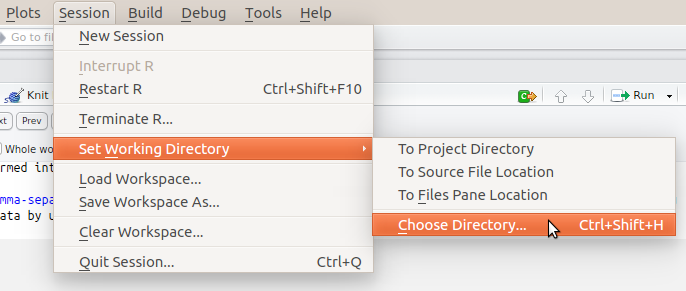

  
#  {.tabset .tabset-fade .tabset-pills}

```{r, echo=FALSE, warning=FALSE, message=FALSE}
options(stringsAsFactors = FALSE)
library(knitr)
```

## Install packages

For this practical, we need to **open up RStudio and install the necessary packages for R**.  Note that with R, the terms "package" and "library" are often used interchangeably and they mean the same thing.  

Today we'll need to install the **[tidyverse](https://www.tidyverse.org/)** package.  The Tidyverse package is a sort of "meta-package" that actually installs a collection of other packages which are very useful for working with R.  In other words, instead of installing twenty different packages individually, you just install this one package and it grabs everything that you need.  The online book [R for Data Science](http://r4ds.had.co.nz/) goes into much more detail about how these packages can be used, and may be useful to refer to in the future, especially if your thesis project involves a lot of data analysis in R.

For this practical, there are two particular packages contained within Tidyverse that we will be using:

* The first package is [`dplyr`](http://dplyr.tidyverse.org/), which makes it easy to do very complex operations with data frames.  
* The second is [`ggplot2`](http://docs.ggplot2.org/current/) which allows you to plot data using a variety of visualizations.

### Installation Steps

In the bottom right quadrant of RStudio, locate the `Packages` tab, and click on `Install`:

<center></center>&nbsp;<p>

Then type in the name of the package `tidyverse`.  You should see it auto-complete as you type:

<center></center>&nbsp;<p>

Click on `Install` and make sure that `Install dependencies` is checked:

<center></center>&nbsp;<p>

The installation may take a minute or two because of the number of different packages it has to install.  You should then see statements like this in the console on the bottom left quadrant:

<center></center>&nbsp;<p>

Once you see `package ‘tidyverse’ successfully unpacked and MD5 sums checked`, then things have been installed successfully.

You can also install packages just by typing:

```{r, eval=FALSE}
install.packages("tidyverse")
```

We first need to load the library that we'll be using for the rest of this tutorial:

```{r, message=FALSE}
library(tidyverse)
```

After running this command, you may see messages like this:
<center></center>
For this practical, these warnings are normal and won't cause a problem.

If later on you see an error that says something like `could not find function`, then that means that you forgot to load the library and that you need to make sure to run the `library(tidyverse)` command.

## Data Types

### Common Data Types

There are several data types you'll frequently use when working with R.  In the previous practical we discussed the first four of these.  

* `numeric` - integers, real numbers
* `character` - "a", "hello world"
* `matrix`
* `data.frame`
* `logical` - boolean values of `TRUE`, `FALSE`
* `factor` - typically used to indicate categories/labels for data observations

Within a single data frame, we can have different data types per column.  Note that here we use factors in the `type_of_person` column to label people as `doesn't like cheese` and `likes cheese`.  In the `likes_cheese` column, we encode the same information but as a series of `TRUE` and `FALSE` values.  

If we have multiple labels such as `doesn't like cheese`, `likes Gouda cheese`, `likes stinky cheese`, then it makes sense to use factors since they can support as many distinct categories as you wish to have.

```{r}
df = data.frame(person = c("Alice", "Bob", "Carol"),   # character
                type_of_person = factor(c("doesn't like cheese", "likes cheese", "likes cheese")),  # factor
                favourite_number = c(4, 8, 9),         # numeric
                likes_cheese = c(FALSE, TRUE, TRUE))   # logical
```

### Determining Data Types

When working with R, you may sometimes need to check which data types you are working with.  This is typically necessary when you run into some strange error or your calculation doesn't seem to give you the correct results.

To do this, use `class()` to see what type of data type you are working with

```{r}
# Some logical values
a = TRUE
class(a)
b = c(TRUE, FALSE, TRUE)
class(b)

# numeric
a = 3
class(a)
b = 3.14:10
class(b)

# character
a = "3"
class(a)
b = c("hello", "this", "is", "a", "vector", "of", "characters")
class(b)
```

You can use `class()` also on the columns of a data frame.
```{r}
class(df$person)
class(df$type_of_person)
class(df$favourite_number)
class(df$likes_cheese)
```

### Converting between Data Types

Occasionally you may find that you are working with data that is not of the correct data type.  You can fix this by using one of the following functions:

* `as.numeric()`
* `as.factor()`
* `as.matrix()`
* `as.data.frame()`

We can convert the character `3` into the number `"3"` and vice versa:
```{r}
as.numeric("3")
as.character(3)
```

#### Factors

Factors are a bit of a strange data type since they're generally used to represent categories of things.  If we create a factor for a vector we see:
```{r}
as.factor(c(3, 4, 7, 2, 4, 3))
```

The part about `Levels: 2 3 4 7` shows that its treating these numbers as labels or categories.  In other words, these values would be used to say things like Category 2 = "brown hair", Category 3 = "black hair", etc.

We can also convert factors into characters, in which case we'll have a character vector:
```{r}
as.character(df$type_of_person)
```

You can also convert them to numbers, although this is not necessarily useful.  
```{r}
as.numeric(df$type_of_person)
```

Occasionally when you read in a data file, R may interpret numbers as factors, in which case you have to convert the factors first to characters and then to numbers
```{r}
a = as.factor(c(3, 4, 7, 2, 4, 3))
class(a)                          # first check if this is a factor
as.numeric(a)                     # these don't look like the numbers
as.character(a)                   # these look like the numbers, but they're in character form
as.numeric(as.character(a))       # this is what we need
a <- as.numeric(as.character(a))  # use this to overwrite the original value
a
```

## Relational Operators

Relational operators allow us to compare values and see if these values meet some condition or not.  In the previous practical we used some of these to help with subsetting sets of elements from vectors, matrices and data frames.  Below we show more of the operators and give a more detailed overview of how they work.

Operators you will commonly used are:

* `!=`
* `==`
* `>`, `<`
* `>=`, `<=`
* `%in%`

Assign a value to `a` so we can then try out different relational operators on it.
```{r}
a <- 5
```

### `!=` not equal to
```{r}
a != 6
a != 5
```

When you use these relational operators on a vector (or a matrix or data frame), it performs an evaluation on each element in the vector, resulting in a vector of `TRUE` and `FALSE` values

```{r}
b = c(3, 7, 2, 1, 4)
b != 7
```

Again, we can use this to return the subset of elements matching the criteria.
```{r}
b[b != 7]
```

And we can see that the results above are the same as the statement below:
```{r}
b[c(TRUE, FALSE, TRUE, TRUE, TRUE)]
```

### `==` equal to
```{r}
a == 5
```

### `>`, `<` greater than, less than
```{r}
a > 5
```

### `>=`, `<=` greater/less than or equal
```{r}
a <= 5
```

### `%in%` value is in a list
```{r}
a %in% 1:10
```

### `!` negation
This takes the opposite of the value that comes after it
```{r}
(a == 5)
!(a == 5)
```

### Don't use:

* `=` - only used for variable assignment
* `=>`, `=<` - incorrect form for greater/less than or equal

## dplyr

In the previous practical, we talked about subsetting elements within a data frame, although you'll often need to do much more complex operations.  

One package that helps with this is the **[dplyr package](https://cran.rstudio.com/web/packages/dplyr/vignettes/introduction.html)**.  The main idea with `dplyr` is that you start off with data in a data frame, and then you perform a series of operations, or data transformations, which are connected together via the `%>%` symbol which acts as a sort of "pipe" through which data flows.  The philosophy behind `dplyr` is that it provides you way to specify a set of "verbs" describing what you want to do with your data.

In very general terms, with the `dplyr` library we can create a series of statements that look like:

**some data frame** `%>%` **operation 1** `%>%` **operation 2**

### `select()`

In the following example, we use `select()` to return a data frame consisting of the `mpg` and `cyl` columns.  

```{r}
mtcars %>% select(mpg, cyl)
```

Note that you can also write the same command as shown below, where you create a new line after the `%>%` symbol.  This can be useful to do if you have a large number of operations.

```{r, eval=FALSE}
mtcars %>% 
  select(mpg, cyl)
```

Note if you try to start a new line with the `%>%` symbol, you will get an error.  This symbol always has to be at the end of the previous line, like we showed above.

```{r, error=TRUE}
mtcars 
  %>% select(mpg, cyl)
```

### `filter()`

We can use `filter()` to only return rows matching some condition.  Below we only keep the rows which have a value of `hp` below 90.
```{r}
mtcars %>% 
  filter(hp < 90)
```

Within a single `filter()` statement you can have multiple comparisons separated by a comma.  Here we only keep rows where the value of `hp` is between 100 and 200.
```{r}
mtcars %>% 
  filter(100 < hp, hp >= 200)
```

As mentioned, we can chain together multiple operations.  Below we combine the `filter()` and `select()` statements from above.

```{r}
mtcars %>% 
  filter(100 < hp, hp <= 200) %>% 
  select(mpg, cyl)
```

The command above is basically of the form: `mtcars` `%>%` **"keep these rows"** `%>%` **"keep these columns"**

In the `filter()` statement, rows are only returned which match **all** of the conditions specified.  For example, the command below won't return any values since a car can't have a `hp` value simultaneously below 100 and above 200.
```{r}
mtcars %>% 
  filter(hp < 100, hp >= 200) %>% 
  select(mpg, cyl)
```

However, we can use `filter()` to find all cars which have a `hp` below 100 **or** above 200.  For this we use the `|` symbol which specifies a logical "or".  R will read this as meaning something like `filter(hp < 100` **"or"** `hp >= 200)`.
```{r}
mtcars %>% 
  filter(hp < 100 | hp >= 200) %>% 
  select(mpg, cyl)
```

By using the `&` symbol you can specify a logical "and".  This is basically what the comma in the one of the previous examples was doing, and we could rewrite `filter(100 < hp, hp <= 200)` as `filter(100 < hp & hp <= 200)` since we're looking for rows where `hp` is above 100 **and** less than or equal to 200.
```{r}
mtcars %>% 
  filter(100 < hp & hp <= 200) %>% 
  select(mpg, cyl)
```

Filter can also be used on multiple columns.  Note that we create a separate clause `(hp >= 250 | hp < 100)` to contain a logical "or" statement.  The reason for the parenthesis is that this is a single condition that we want to match.  For the other conditions, we want rows where the value of `cyl` is 4, and the `mpg` is greater than 30.
```{r}
mtcars %>% 
  filter((hp >= 250 | hp < 100),   # condition 1
         cyl == 4,                 # condition 2
         mpg > 30) %>%             # condition 3
  select(mpg, cyl)
```

The order of the statements will sometimes matter and you should pay attention to this.  For example, note that if we put the `select()` statement before the `filter()` statement, we will get an error since our `select(mpg,cyl)` statement only keeps the `mpg` and `cyl` columns, while the `filter()` statement needs information on the `hp` column.  This is what is meant by `Evaluation error: object 'hp' not found`.  In other words, you will sometimes run into errors with `dplyr` when your statements aren't in the correct sequence.

```{r, error=TRUE}
mtcars %>% 
  select(mpg, cyl) %>% 
  filter((hp >= 250 | hp < 100),   # condition 1
         cyl == 4,                 # condition 2
         mpg > 30)                 # condition 3
```

### `summarise()`

The functions `filter()` and `select()` allow us to select specific rows and columns, although we usually also want to do some sort of statistical calculations over the values in a data frame.

Below we use `summarize()` to find the average and standard deviation of all the horsepower (`hp`) values.  Only a single row is returned since these calculations are performed over the entire set of rows.  The `summarise()` function actually creates new columns based on the names you specify, and multiple columns can be created by using a comma.

The commands are of the form

* `summarize(`**new_column_name**`=`**operation**`)`
* `summarize(`**new_column_name**`=`**operation**`, `**another_new_column_name**`=`**another operation**`)`

Find the average `hp`
```{r}
mtcars %>% summarize(avg_hp = mean(hp))
```

Note that you should always precede these statements with your data frame (i.e. `mtcars %>% `).  Without this, `dplyr` won't know where to find the values for `hp`.

```{r, error=TRUE}
summarize(avg_hp = mean(hp))
```

Find the average `hp` and standard deviation of `hp`:

```{r}
mtcars %>% summarize(avg_hp = mean(hp), sd_hp = sd(hp))
```

Find the average fuel efficiency (`mpg` = "miles per gallon") for different ranges of horsepower (`hp`)

```{r}
mtcars %>% filter(hp < 100) %>% summarise(avg_mpg = mean(mpg))

mtcars %>% filter(100 <= hp, hp < 200) %>% summarise(avg_mpg = mean(mpg))

mtcars %>% filter(200 <= hp, hp < 300) %>% summarise(avg_mpg = mean(mpg))
```


## ggplot2 Basics

Many visualizations created with R are often created using the **[ggplot2 library](http://ggplot2.org/)**.  What's interesting about this library is that way in which it allows you to construct visualizations.  The gg in ggplot2 stands for the Grammar of Graphics. The idea is that when you create plots, you are basically writing sentences that are of the form:
  
  `Here's my data frame` + `Here are the x and y columns` + `Apply this kind of plot to that data` + `These are the axis labels` + `here are some more additional transformations`

The syntax may look strange at first, although it’s a very modular approach, and you can create very complex visualizations just by adding new parts to these sentences.

We'll first start off by writing code that *doesn't work*, but it at least shows how we build up these statements.  First we have the `ggplot()` function.  You need to call this whenever you want to make a plot.

```{r, eval=FALSE}
ggplot()
```

Next we need to specify which data frame we want to use, via the `data=` argument.  In this case we use the `mtcars` data frame which we first showed in the previous practical.

```{r, eval=FALSE}
ggplot(data=mtcars)
```

At this point, ggplot knows that we want to plot a data frame, but it's not sure which columns it should look at.

We now have to use `aes()` to map what are called the aesthetics.  Here we tell ggplot which columns are to be used for the `x` and `y` values in the plot.  

Note that we use don't use quotation marks for the column names, i.e. `aes(x=mpg, y=cyl)` is the correct syntax, while `aes(x="mpg", y="cyl")` will not give you the results that you want.
```{r}
ggplot(data=mtcars, aes(x=mpg, y=cyl))
```

Now we see a blank grid, whose ranges correspond to the min/max values of the `cyl` and `mpg` columns.  At this point ggplot knows *what* we want to plot, but not *how* to plot it.  To do this, we need to add one of the "Geoms" as referred to on the [Data Visualization with ggplot2 Cheat Sheet](https://www.rstudio.com/wp-content/uploads/2015/03/ggplot2-cheatsheet.pdf).  These are the functions which begin with `geom_` and look like `geom_point`, `geom_line`, `geom_boxplot`, etc.

In other words, you will be writing a lot of statements of the form:

`ggplot(data=` **your data frame** `, aes(x=` **column in your data frame** `, y=` **another column in your data frame** `)) + geom_` **point, line, etc.**


### Scatter plot
To understand this, we can first do a simple scatter plot.  You'll notice with the syntax that we first start with the `mtcars` data frame, then we specify which columns are to be associated with the `x` and `y` values, and then we specify that we want to plot the data as points by adding `+ geom_point()`.

```{r mtcarsGeomPoint, cache=TRUE}
ggplot(mtcars, aes(x=hp, y=mpg)) + geom_point()
```

In the following examples, you may see the code examples split over multiple lines.  The two statements below are actually equivalent, but by spreading the commands over multiple lines it can sometimes help to make things more readable by separating the code into its different functional pieces.

```{r, eval=FALSE}
ggplot(mtcars, aes(x=hp, y=mpg)) + geom_point()

ggplot(mtcars, 
       aes(x=hp, y=mpg)) + 
  geom_point()
```

Note that the `+` can't be at the beginning of the line, otherwise you will get an error.  It always has to appear at the end of the line, just like with the `%>%` used for `dplyr`.

**Incorrect:**
```{r, error=TRUE, eval=FALSE}
ggplot(mtcars, 
       aes(x=hp, y=mpg))
  + geom_point()
```

We can also use values from other columns to modify particular attributes of the points.  For example, we can set the color of the points to indicate the number of cylinders
```{r mtCarsPointColor, cache=TRUE}
ggplot(mtcars, aes(x=hp, y=mpg, colour=cyl)) + geom_point()
```

We can set the size of the points based on the weight of the car
```{r mtCarsColorSizePoint, cache=TRUE}
ggplot(mtcars, aes(x=hp, y=mpg, colour=cyl, size=wt)) + geom_point()
```

### Multiple Plot Types

Although it's not directly useful for the `mtcars` data set, you should know that `ggplot` makes it easy for you to overlay multiple visualizations.  Below we create both a scatter plot and a line plot.
```{r}
ggplot(mtcars, aes(x=hp, y=mpg)) + geom_point() + geom_line()
```

Because the specify the data frame and `aes` in the `ggplot()` function, we don't have to specify them later since ggplot is already aware of them.  This saves you from having to write more extensive code like this:
```{r}
ggplot() + 
  geom_point(data=mtcars, aes(x=hp, y=mpg)) + 
  geom_line(data=mtcars, aes(x=hp, y=mpg))
```

### Boxplot

For this example, we need to specify `x=factor(cyl)` to make sure that there is a boxplot drawn for each unique value of `cyl`.

```{r mtCarsBoxPlot, cache=TRUE}
ggplot(mtcars, aes(x=factor(cyl), y=mpg)) + geom_boxplot()
```

Without this step, only a single boxplot will be drawn:
```{r}
ggplot(mtcars, aes(x=cyl, y=mpg)) + geom_boxplot()
```

### Histogram
Histogram of the number of cars with a particular fuel economy value:

```{r mtCarsHistorgram, cache=TRUE}
ggplot(mtcars, aes(x=mpg)) + geom_histogram()
```

We can also change the bin width:
```{r mtCarsHistorgram2, cache=TRUE}
ggplot(mtcars, aes(x=mpg)) + geom_histogram(binwidth=5)
```

### Bar charts
Count the number of cars with specific numbers of cylinders
```{r mtCarsBarChart, cache=TRUE}
ggplot(mtcars, 
       aes(x=cyl)) + 
  geom_bar()
```

### Pie chart

Pie charts can be created as well, although they require a few more steps.  Part of the reason for this is that [many data visualization experts discourage their use](https://www.quora.com/How-and-why-are-pie-charts-considered-evil-by-data-visualization-experts) since other types of visualizations can communicate the information more effectively.

The general strategy to create a pie chart using ggplot2 is to first create a bar chart and then to use polar coordinates to turn the bars into a circle.

In other words, we start with this:
```{r mtCarsNotYetPieChart, cache=TRUE}
ggplot(mtcars, 
       aes(x=factor(1), fill=factor(cyl))) + 
  geom_bar(width=1)
```

To explain what's going on:

* `x=factor(1)` - This places the bars at the same location, which allows them to be stacked
* `fill=factor(cyl)` - The fill color for the bars is based on the value of `cyl`
* `geom_bar(width=1)` - This is needed to that there isn't a hole in the plot when we use the code in the step below.
* **Note:** the height of the bars is counting the number of cars (i.e. number of rows in the `mtcars` data frame) with a specific value for `cyl`.  In other words, the size of the pie slices is not based on actual numeric values in `mtcars`.

We then turn this into a pie chart by adding `+ coord_polar(theta="y")`:
```{r mtCarsPieChart1, cache=TRUE}

# this does a count
ggplot(mtcars, 
       aes(x=factor(1), fill=factor(cyl))) + 
  geom_bar(width=1) + coord_polar(theta="y")
```

If we want to create a pie chart where the size of the slices correspond to actual values in the data and not just to counts of things with the same values, we need to take a slightly different approach.

Here we have a data frame listing types of animals and values associated with them:
```{r animalsDataFrame, cache=TRUE}
animals = data.frame(animal_type = c("chickens", "cows", "pigs"),
                     farm_count = c(20, 10, 5))
animals
```

We then add `y=farm_count` and `stat="identity"` to make sure that this is plotted correctly.  We also use `theme_void()` to remove the axis labels that we saw in the previous plot.

Using `stat="identity"` means that the size of the pie slices are based on the values contained in the data, and not on the count of things with the same values.

```{r mtCarsPieChart2, cache=TRUE}
ggplot(animals, 
       aes(x=factor(1), y=farm_count, fill=factor(animal_type))) + 
  geom_bar(width=1, stat="identity") + 
  coord_polar(theta="y") + 
  theme_void()

```

### A Note on Colors

If you want to specify a specific color for the points, you need to place that within the `geom_` statement.  If `colour` is inside the `ggplot()` function, then the color you get will get will not be the one you specify:
```{r}
# these points are not blue
ggplot(mtcars, aes(x=hp, y=mpg, colour="blue")) + geom_point()
```

```{r}
# these points are not blue either
ggplot(mtcars, aes(x=hp, y=mpg), colour="blue") + geom_point()
```

To fix this, `colour` needs to be specified outside the `aes()` function:
```{r}
# these points are blue
ggplot(mtcars, aes(x=hp, y=mpg)) + geom_point(colour="blue")
```

If you want to make values for one color red and one color blue, then one way to achieve this is to do the following.  We use `dplyr` to create data frames where `cyl` is 4 and 6 respectively, and then assign columns in the `geom_point()` functions, where `colour` is outside of `aes()`.  Note that `ggplot()` has to be empty since we are plotting two different data frames.

```{r}
ggplot() + geom_point(data = mtcars %>% filter(cyl == 4), aes(x=hp, y=mpg), colour="red") + 
  geom_point(data = mtcars %>% filter(cyl == 6), aes(x=hp, y=mpg), colour="blue")
```

### Horizontal, Vertical & Diagonal Lines
`ggplot` also allows you to horizontal, vertical and diagonal lines.  These are useful if you wish to indicate some level or threshold in the data.
```{r}
ggplot(mtcars, aes(x=hp, y=mpg)) + geom_point() + geom_hline(yintercept = 10)
ggplot(mtcars, aes(x=hp, y=mpg)) + geom_point() + geom_vline(xintercept = 100)
ggplot(mtcars, aes(x=hp, y=mpg)) + geom_point() + geom_abline(intercept=5, slope=0.1)
```

### Titles and Axis Labels

You can overwrite the default axis labels by using `xlab()` and `ylab()`.  A title can also be added by using `ggtitle()`.
```{r}
ggplot(mtcars, aes(x=hp, y=mpg)) + geom_point() + xlab("Horsepower") + ylab("Miles Per Gallon") + 
  ggtitle("Horsepower vs. Miles Per Gallon for Some Sports Cars")
```

## Reading & Plotting from CSV Files

The following example is based on [CO2 emissions data from the UNFCCC](http://unfccc.int/ghg_data/ghg_data_unfccc/time_series_annex_i/items/3814.php), specifically the ["CO2 excluding LULUCF" Excel spreadsheet](http://unfccc.int/files/ghg_emissions_data/application/x-zip-compressed/ai_co2_wolulucf.zip.zip) which we've transformed into a CSV file.

### What is CSV?

CSV stands for ["comma-separated values"](https://en.wikipedia.org/wiki/Comma-separated_values) which means that you represent tabular data by using commas to separate values from different columns:

```{csv}
animal,farm_count
chickens,20
cows,10
pigs,5
```

While you can technically read Excel files into R, reading CSV files is much much faster as it is a very simple data format.

### Saving the File to Your Computer

Now we'll load in an example data file. For this, you'll need the UNFCCC_CO2_Emissions.csv file.  To get it, **right click** on this link: [UNFCCC_CO2_Emissions.csv](https://raw.githubusercontent.com/cbdavis/DASM/master/2017/data/UNFCCC_CO2_Emissions.csv) and select **"Save Target As"** or **"Save Link As"** to save it to your computer.

Internet Explorer might try to save this as "UNFCCC_CO2_Emissions.**txt**", make sure to save this as "UNFCCC_CO2_Emissions.**csv**" or adjust your code so that it knows to read the correct file.

### Set Correct Working Directory

One thing you need to check is your working directory. This is the directory where R looks for any files.  You can set this in RStudio `Session` -> `Set Working Directory` -> `Choose Directory`

Note that for this step, you're **selecting the directory** that you just placed the csv file in, **not the actual csv file itself** (R won't let you select the file since it only wants to know the directory).  In other words, you're just telling R that when you mention a file it should look there.  Without this, you would have to specify the entire directory structure leading to that file.

<center></center>

Make sure that this is set to the directory where you have placed the `UNFCCC_CO2_Emissions.csv` file.

### Read CSV File

```{r, eval=FALSE}
df <- read.csv(file="UNFCCC_CO2_Emissions.csv")
```

```{r, echo=FALSE}
df <- read.csv(file="./data/UNFCCC_CO2_Emissions.csv")
```

### Inspect Data

When you do this, you'll notice that the data frame `df` appears in the `Environment` tab, and we can see that it has 1012 rows (observations) and 3 variables (columns).
<center></center>

If you click this, you will be able to inspect the actual values in the data frame:
<center></center>

Use `summary` to get a quick overview of what is in the data:
```{r}
summary(df)
```
From this we see that it contains data on years from 1990 until 2012.

If you have read everything in correctly, you should get the following values for the average and standard deviation of the `CO2_Mt` column.

```{r}
mean(df$CO2_Mt)
sd(df$CO2_Mt)
```

Create line plots per country of the amount of CO2 emissions:
```{r EmissionsPerCountryLinePlot, fig.width=12, fig.height=6, cache=TRUE}
ggplot(df, aes(x=Year, y=CO2_Mt, colour=Country)) + geom_line()
```

Create a stacked area chart showing how each country's CO2 emissions contributes to the total:
```{r EmissionsPerCountryArea, fig.width=12, fig.height=6, cache=TRUE}
ggplot(df, 
       aes(x=Year, y=CO2_Mt, fill=Country)) + 
  geom_area()
```

Same plot, but using `geom_line(aes(ymax=CO2_Mt), position="stack", size=0.1)` to add black lines to help better distinguish the individual countries.

```{r EmissionsPerCountryAreaWithSeparatingLine, fig.width=12, fig.height=6, cache=TRUE}
ggplot(df, 
       aes(x=Year, y=CO2_Mt, fill=Country)) + 
  geom_area() + 
  geom_line(aes(ymax=CO2_Mt), position="stack", size=0.1)
```

In the previous plots, it's a bit difficult to distinguish countries with similar colors.  We can also use `facet_wrap` to create plots for individual countries.

* `~Country` - create individual plots per distinct values in the `Country` column.
* `scales="free_y"` - each plot will have its y axis scaled individually.  This helps to view the trends from countries with less CO2 emissions.

```{r EmissionsPerCountryFacetWrap, fig.width=12, fig.height=10, cache=TRUE}
ggplot(df, aes(x=Year, y=CO2_Mt)) + geom_line() + facet_wrap(~Country, scales="free_y")
```

The plot above shows the variation, but you'll notice that the minimum value on the y scale is not set to zero.  This means that the variation observed may not actually be that big when considering the overall amount of emissions.  To fix this, we update our code to use `ymin=0` so that we can get a picture of the absolute magnitude of emissions.

```{r EmissionsPerCountryFacetWrapYmin0, fig.width=12, fig.height=10, cache=TRUE}
ggplot(df, aes(x=Year, y=CO2_Mt, ymin=0)) + geom_line() + facet_wrap(~Country, scales="free_y")
```

