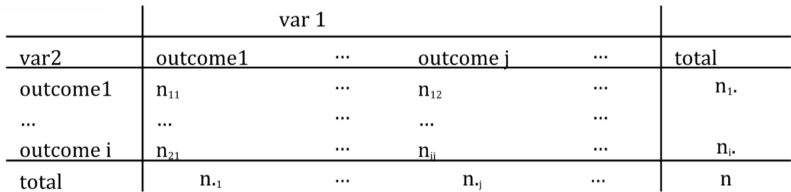

  
# {.tabset .tabset-fade .tabset-pills}
  
```{r setup, include=FALSE}
knitr::opts_chunk$set(echo = TRUE)
```

## Tabular Data

### Getting started

Make sure to load the `tidyverse` library so we can do plotting later on.
```{r, message=FALSE, warning=FALSE}
library(tidyverse)
```

### Working with data frame columns (review)

One of the tasks we'll show in this practical relates to constructing tables from categorical data.  Before doing this, we should first review a few useful functions for working with tabular data in data frames.

The `iris` data frame is an example data set that is included with R, just like the `mtcars` data we worked with in previous practicals.

Get a list of columns in a data frame:
```{r}
colnames(iris)
```

Summarize a data frame, showing the columns and statistical information about the values in those columns:
```{r}
summary(iris)
```

Extracting columns with the `$` symbol.  Note that if you type `iris$` and then press the tab key, you will get a list of suggestions for all of the column names.
```{r}
iris$Sepal.Length
```

### Cross Tabulation

[Cross-tabulation](https://en.wikipedia.org/wiki/Contingency_table), or a contingency table, is a technique that counts the number of observations at permutations of variable values.  As an example, if you collected data on people's hair color and eye color, a contingency table could be used to analyze the data and say how many people have particular combinations of hair color and eye color.  Using this you could see how many people have both brown hair and green eyes, how many people have both blond hair and blue eyes, etc.

Cross tabulation can be performed in R using the `table()` function.

#### Syntax of the `table()` function

By typing `?table` in the console, you see:  *table uses the cross-classifying factors to build a contingency table of the counts at each combination of factor levels.*

By "factor levels", this just means the distinct values for the factors.  Factors are the same thing as the categories or categorical data that was mentioned in the lecture.

```{r, eval=FALSE}
table(...,
      exclude = if (useNA == "no") c(NA, NaN),
      useNA = c("no", "ifany", "always"),
      dnn = list.names(...), deparse.level = 1)
```

The relevant argument for this practical is:

* `...` - *one or more objects which can be interpreted as factors (including character strings), or a list (or data frame) whose components can be so interpreted. (For as.table, arguments passed to specific methods; for as.data.frame, unused.)*

In the examples below you'll see that `...` takes the form of one or two variables which we use to construct the contingency table.

Whenever you see `...` in documentation for R, it generally means that multiple objects can be passed to the function.

#### Construct a table from one or two variables 

Here we create a table from the `cyl` (number of cylinders) column of the `mtcars` data set:
```{r}
table(mtcars$cyl)
```

Reading across (bottom left -> top left, bottom center -> top center, etc), we see that there are:

* 11 cars with 4 cylinders
* 7 cars with 6 cylinders
* 14 cars with 8 cylinders

Next we create a table from the `cyl` and `gear` (number of forward gears) columns of the `mtcars` data set:

```{r}
table(mtcars$cyl, mtcars$gear)
```

With the `table` function, the first value you enter (`mtcars$cyl`) will show up on the rows, and the second (`mtcars$gear`) will show up in the columns.  For example, from the table we can see that there are 12 cars with 8 cylinders and 3 gears, while there are 0 cars with 4 gears and eight cylinders.

#### Exercise

Load in data on heart attack victims.  With R you can download a file directly from the Internet.  Note that `sep="\t"` means that the file is tab delimited
```{r}
df = read.csv("https://github.com/cbdavis/DASM/raw/master/2017/data/heartatk4R.txt", sep="\t")
```

Now construct a two way table from the categorical variables `SEX` and `DIED`.  You should see:

```{r, echo=FALSE}
table(df$SEX, df$DIED)
```

## Chi-square test for goodness of fit

### Review from lecture

Hypothesis: n events that occur with probabilities $p_i$

Observations: counts for each event ($n_1$, $n_2$, …, $n_i$, …,$n_k$)

Test statistic:  

$\chi^{2} = \sum{}\frac{(observed - expected)^{2}}{expected} = \sum_{i=1}^{k} \frac{(n_i-E_i)^2}{E_i}$

with $E_i = n * p_i$

### Syntax of chi-square test for goodness of fit

For the chi-square test for goodness of fit, you only need to have two arguments specified:

```{r, eval=FALSE}
chisq.test(x, p) 
```

Arguments:

* `x`	- *a numeric vector or matrix. x can also be a vector of factors.*
* `p` - *a vector of probabilities of the same length of x. An error is given if any entry of p is negative.*

If `p` is not specified, then `chisq.test` automatically assumes equal probabilities. 

### Example 

This is the dice example mentioned in Lecture 6, Slide 5.

You roll a die 100 times, and these are the number of counts associated with each value of the die that was observed.

```{r}
die = c(1,2,3,4,5,6)
count = c(11,16,25,13,21,14)
```

#### For a fair dice: what would be the expected probabilities?

We would expect $p_i = \frac{1}{6}$ for each value of $i$

For the counts at each die value, we would expect:
```{r}
exp = rep(1/6, 6) * 100
exp
```

#### Question: Is the die fair at 95% confidence level?

* $H_0$: the probability of throwing each number is equal = $\frac{1}{6}$ 
    * i.e. $p_i = \frac{1}{6}$ for all $i$ 
* $H_a$: at least one number comes at a different frequency 
    * i.e. $p_i \neq \frac{1}{6}$ for at least one $i$


Use the `chisq.test` function to see the same results:
```{r}
chisq.test(count, p=rep(1/6, 6))
```

The peak should mean that we have the highest probability of getting a $\chi^2$ value of 3 with a fair die:

```{r, echo=FALSE}
# manuals for adding math symbols to plots is at:
# https://stat.ethz.ch/R-manual/R-patched/library/grDevices/html/plotmath.html
# http://vis.supstat.com/2013/04/mathematical-annotation-in-r/
chi_squared = chisq.test(count, p=rep(1/6, 6))
x = seq(0,20,0.01)
y = dchisq(x, df=5)
df = data.frame(x=x, y=y)
ggplot(df, aes(x,y)) + geom_line() + 
  geom_area(data = subset(df, x > qchisq(0.95, 5)), 
            aes(x=x, y=y), fill="red", alpha=0.5) + 
  geom_vline(xintercept = chi_squared$statistic, linetype="dashed") + 
  annotate("label", x = chi_squared$statistic, y=0.1, label="list(chi^2,'calculated')", parse=TRUE) + 
  geom_vline(xintercept = qchisq(0.95, 5), linetype="dashed") + 
  annotate("label", x = qchisq(0.95, 5), y=0.05, label="chi[list(0.95,5)]^{2}", parse=TRUE) + 
  ylab("probability") + xlab(expression(chi^{2}))
```

### Exercise
This is the example of murder cases from the lecture 

| Sunday | Monday | Tuesday | Wednesday | Thursday | Friday | Saturday | 
|-|-|-|-|-|-|-|-|
| 53| 42| 51| 45| 36| 37| 65 | 

Are the murders equally distributed through the week or not at a confidence level of 0.95?

What are the test hypotheses, df, and p-value?

If you do things correctly (and set `correct=FALSE`), you should see an output of:
```{r, echo=FALSE}
murders <- c(53, 42, 51, 45, 36, 37, 65)
cst = chisq.test(murders,p=rep(1/7, 7), correct=FALSE)
print(cst)

cst = chisq.test(murders,p=rep(1/7, 7))
```

Based on these results, we reject $H_0$, since p < 0.05.  For at least one day of the week, murder rate is different from $\frac{1}{7}$ at the 95% confidence level 

## Chi-square test of independence

### Review from lecture 6

A 2-way table is of the form:



Hypothesis test:

* $\alpha$ = 0.05
* $H_0$ : the outcomes are independent
* $H_a$ : outcomes are dependent

Test statistic:

$\chi^2 = \sum_{i=1}^{k}\sum_{j=1}^{l} \frac{(n_{ij}-n_{i\cdot}*n_{\cdot j}/n)^2}{n_{i\cdot}*n_{\cdot j}/n}$

### Syntax

The syntax for performing a `chisq.test` for a two way table is very simple - in this case `x` is the matrix containing the data for the two way table:
```{r, eval=FALSE}
chisq.test(x) 
```

### Example

A set of cars are observed and per car it is recorded whether the parents and the children are wearing their seatbelts.  We can construct the two-way table of the observations in the code below:

```{r}
seatbelt = rbind(c(56, 8), c(2, 16))
colnames(seatbelt) = c("child_buckled", "child_unbuckled")
rownames(seatbelt) = c("parent_buckled", "parent_unbuckled")

seatbelt
```

We use the following hypotheses and confidence level:

* $H_0$: the variables are independent
* $H_a$: the variables are dependent
* $\alpha=0.05$

We now need to create expected matrix which would show what the expected values would be if the variables are independent.  For this we need to find  $p(A \cap B) = p(A)p(B)$

```{r}
# calculate sums over the rows and columns
parent = rowSums(seatbelt) / sum(seatbelt)
parent
child = colSums(seatbelt) / sum(seatbelt)
child

probabilities = parent %*% t(child)
# add back in the row names and column names
colnames(probabilities) = c("child_buckled", "child_unbuckled")
rownames(probabilities) = c("parent_buckled", "parent_unbuckled")
probabilities

expected_matrix = probabilities * sum(seatbelt)
expected_matrix
```

While the lecure showed how to do the chi-squared test by hand, here we will show how to do it in R by using the `chisq.test()` function.  Make sure to specify `correct=FALSE`, as by default the `chisq.test` function applies a correction if some counts in the table are low.  If you leave the value empty or specify `correct=TRUE` you'll get a slightly deviating value.

```{r}
chisq.test(seatbelt, correct=FALSE)
```

### Exercise
Using the example from question 10.60 in the book (page 556):  A study of potential age discrimination considers promotions among middle managers in a large company. The data are as follows:

| | Under 30 | 30–39 | 40–49 | 50 and Over | Total |
|-|----------|-------|-------|-------------|-------|
| Promoted | 9 | 29 | 32 | 10 | 80 |
| Not promoted | 41 | 41 | 48 | 40 | 170 |
| Totals | 50 | 70 | 80 | 50 | |

Create the above table in R and perform the `chisq.test` on it.  Is there a statistically significant relation between age and promotions?

```{r, echo=FALSE}
vals = rbind(c(9, 29, 32, 10), c(41, 41, 48, 40))
colnames(vals) = c("under_30", "30_39", "40_49", "50_over")
rownames(vals) = c("promoted", "not_promoted")
chisq.test(vals, correct=FALSE)
```

## Q-Q Plots

### Overview

A [Q-Q plot](https://en.wikipedia.org/wiki/Q%E2%80%93Q_plot) (or Quantile-Quantile plot) can be used to see if the values in a sample are normally distributed.  

Suppose you have a sample of values from an unknown population.  In the example below, we're actually sampling from a normal distribution, but pretend for now that we don't know where the data is from.  

```{r}
x = rnorm(50)
x
```

First you order the sample values from the lowest to the highest values.  We can use the `sort()` function for this:
```{r}
x = sort(x)
x
```

You can assign a "cumulative probability" $P_i$ to each measurement with $P_i = \frac{(i - 0.5)}{n}$.  

```{r}
i = seq_along(x)   # creates a sequence of 1, 2, ... up to the length of x (50 in this example)
P = (i - 0.5) / length(x)  # vector of values for each P_i
P
```

$x_i$ has then at least a fraction of $P_i$ data values smaller than $x_i$.

$x_i(P_i)$  is the $P_{i}$-th quantile of the sample.

As an example of this, our 10th element is:
```{r}
x[10]
```

and at the 10th location, our value for P is 
```{r}
P[10]
```

This means that at least `r P[10]*100`% of the values in the data set are smaller than `r x[10]`

We then create a new variable `z` where we find the locations of the quantiles specified in `P`
```{r}
z = qnorm(P, mean = mean(x), sd=sd(x))
```

We then plot `z` versus `x`.  If the line is straight, then the data appears to be normally distributed
```{r}
plot(z,x)
```

In R we can automatically perform all these steps just by using `qqnorm()` and `qqline()`.  

The function `qqnorm()` draws the points in the scatter plot, and `qqline()` draws the line showing where we would expect the points to lie if they are normally distributed.
```{r}
qqnorm(x)
qqline(x)   
```

Even with a low number of samples, many of the points are on the diagonal line, which indicates that our data (which is actually sampled from a normal distribution) looks like it could be normally distributed.

What is we try 500 samples instead of just 50?

```{r}
x <- rnorm(500)
qqnorm(x)
qqline(x)
```

What about 10000 samples?

```{r}
x <- rnorm(10000)
qqnorm(x)
qqline(x)
```

How does a uniform distribution look?

```{r}
x <- runif(100) # 100 samples from a uniform distribution
qqnorm(x)
qqline(x)
```


## Q-Q Plots Exercise

We next use the `faithful` data set which is included with R.  You can type `?faithful` in the RStudio console to get more information on it.  This data is about the [Old Faithful geyser](https://en.wikipedia.org/wiki/Old_Faithful) in Yellowstone National Park in the US.  This geyser is famous for erupting on a very regular schedule and the data set has information on how long the eruptions are (`faithful$eruptions`) and the amount of time until the next eruption (`faithful$waiting`).

Make a Q-Q plot of the waiting times (`faithful$waiting`):

```{r, echo=FALSE}
x = faithful$waiting
qqnorm(x)
qqline(x)
```

This tells us that the eruptions are clearly not normally distributed.  To investigate further, create a histogram of the values:

```{r, echo=FALSE}
ggplot(faithful, aes(x=waiting)) + geom_histogram(binwidth=2)
```

From the histogram, we see from this is that it's clearly bi-modal as there are two distinct peaks.

To investigate further, create a scatter plot showing how the waiting time might be related to the length of the eruption.

```{r, echo=FALSE}
ggplot(faithful, aes(x=eruptions, y=waiting)) + geom_point() + 
  xlab("Length of eruption (minutes)") + 
  ylab("Waiting time until next eruption (minutes)")
```

We see a few things here:

* The longer the eruption, the longer we will have to wait until the next one.  
* There seem to be two distinct clusters.  It's not clear what is causing this, and since the data doesn't mention the date of the eruption, we don't know it randomly switches between short and long eruptions, or if for years there were long eruptions, but now there are only short eruptions due to factors such as earthquakes changing the water supply to the geyser.

We should split up the data into two sets, where one lists all the eruptions that lasted less than three minutes, and the other one contains those which are longer.

Now create two separate data frames from the `faithful` data frame, where `faithful_short` has eruptions < 3 and `faithful_long` has eruptions >= 3

```{r, echo=FALSE}
faithful_short = faithful %>% filter(eruptions < 3)
faithful_long = faithful %>% filter(eruptions >= 3)
```

Create a Q-Q plot for the short eruptions:
```{r, echo=FALSE}
qqnorm(faithful_short$waiting)
qqline(faithful_short$waiting)
```

Create a Q-Q plot for the long eruptions:
```{r, echo=FALSE}
qqnorm(faithful_long$waiting)
qqline(faithful_long$waiting)
```

If we split the data into two clusters, do they seem to be normally distributed?

## One-way ANOVA test

### Review from lecture

For this, we want to test if any of several means are different.  We want to compare the within group variance (${SSD}_{W}$) to the between group variance (${SSD}_{B}$).  If the means are all equal (i.e. the data are all from the same distribution) then the statistic $F$ follows an F-distribution with $(k-1)$, $(n-k)$ degrees of freedom ($F_{k-1,n-k}$).

* ${SSD}_W = \sum_{i} \sum_{j} (x_{ij}-\bar{x}_i)^2$
* ${SSD}_B = \sum_{i} \sum_{j} (\bar{x}_i - \bar{x}_{\cdot})^2 = \sum_{i} n_{i} (\bar{x}_i - \bar{x}_{\cdot})^2$
* ${MS}_W = \frac{{SSD}_{W}}{(n-k)}$
* ${MS}_B = \frac{{SSD}_{B}}{(k-1)}$
* $F = \frac{{MS}_{B}}{{MS}_{W}}$

* If means are the same within the groups then $F$ should be around 1
* If the means are different, then ${MS}_{B} >> {MS}_{W}$

### Syntax of the 1-way test

```{r, eval=FALSE}
oneway.test(formula, data, subset, na.action, var.equal = FALSE)
```

Relevant arguments:

* `formula`	- a formula of the form lhs ~ rhs where lhs gives the sample values and rhs the corresponding groups.
* `data` - an optional matrix or data frame (or similar: see `model.frame`) containing the variables in the formula formula. By default the variables are taken from environment(formula).
* `subset` - an optional vector specifying a subset of observations to be used.  Normally we don't use this option.
* `var.equal` - a logical variable indicating whether to treat the variances in the samples as equal. If `TRUE`, then a simple F test for the equality of means in a one-way analysis of variance is performed. If `FALSE`, an approximate method of Welch (1951) is used, which generalizes the commonly known 2-sample Welch test to the case of arbitrarily many samples.

The formula we will use is `cal~month` (calories grouped by month).  Both `cal` and `month` correspond to the names of the columns in a data frame.

### Example

This is the example on number of calories consumed by month (Lecture 6, slide 43).

Fifteen subjects were randomly assigned to three time groups, and their amount of daily calories consumed was recorded (`may`, `sep`, `dec`).

We want to know if there is a difference in calorie consumption between the months.

```{r}
# values for the different months
may <- c(2166,1568,2233,1882,2019) 
sep <- c(2279,2075,2131,2009,1793) 
dec <- c(2226,2154,2583,2010,2190) 

# create a vector containing the 5 values from may, the 5 values from sep, etc.
cal = c(may, sep, dec) 
cal

# The cal vector shows the numbers, but we need another vector which helps us 
# to know which months those values are associated with.
# We now need to create a vector of the same length as the cal vector
# where each element is text that corresponds to the month of the observation in cal
# since we have 5 values for may, sep & dec, we repeat "may", "sep", and "dec" 5 times each
month = c(rep("may", 5), 
          rep("sep", 5), 
          rep("dec", 5)) 
month

# now we join these vectors together into a dataframe
data1= data.frame(cal, month)
# show what the data looks like
data1

# perform the 1-way ANOVA test
oneway.test(cal~month, data1)
```

Based on these values, we cannot reject $H_0$, i.e. the results do not support the hypothesis that calorie intake varies by month.

### Exercise

A set of four groups of infants were observed and data was compiled on their age at walking (in months).  The four groups are defined as follows:

* **active** - test group receiving active training; these children had their walking and placing reflexes trained during four three-minute sessions that took place every day from their second to their eighth week of life.
* **passive** - passive training group; these children received the same types of social and gross motor stimulation, but did not have their specific walking and placing reflexes trained.
* **none** - no training; these children had no special training, but were tested along with the children who underwent active or passive training.
* **ctr.8w** - eighth-week controls; these children had no training and were only tested at the age of 8 weeks.

The values for each group are:

* **active**: `c(9.00, 9.50, 9.75, 10.00, 13.00, 9.50)`
* **passive**: `c(11.00, 10.00, 10.00, 11.75, 10.50, 15.00)`
* **none**: `c(11.50, 12.00,  9.00, 11.50, 13.25, 13.00)`
* **ctr.8w**: `c(13.25, 11.50, 12.00, 13.50, 11.50)`

Using what you learned above, first put the data into a format that can be used with the one way test, and conduct the test.  

```{r, warning=FALSE, echo=FALSE}
infants = bind_rows(data.frame(group = "active", 
                               walking_age_months = c(9.00, 9.50, 9.75, 10.00, 13.00, 9.50)), 
                    data.frame(group = "passive", 
                               walking_age_months = c(11.00, 10.00, 10.00, 11.75, 10.50, 15.00)),
                    data.frame(group = "none", 
                               walking_age_months = c(11.50, 12.00,  9.00, 11.50, 13.25, 13.00)),
                    data.frame(group = "ctr.8w", 
                               walking_age_months = c(13.25, 11.50, 12.00, 13.50, 11.50)))

oneway.test(walking_age_months~group, infants)
```

## Monte Carlo Simulation 

### Quick Review

We have a function $x = f(u,v)$ where:

* $u$ has uncertainty $s_u$
* $v$ has uncertainty $s_v$

We then:

* Construct a normal distribution $f_{n,u}$ using the mean found for $u$ and a standard deviation $s_u$ 
* Construct a normal distribution $f_{n,v}$ using the mean found for $v$ and a standard deviation $s_v$
* Take a random value $u_1$ from  fn,u and $v_1$ from fn,v  and calculate $x_1 = f(u_1, v_1)$
* Repeat n times
* Take average (or median) of all $x_i$ for (i = 1, ... n) 

### Example

Assume that for a research project you are told to calculate the uncertainty for the following formula:

$$f(p,q) = \frac{p \cdot q}{p + q}$$

For both $p$ and $q$ we have evidence of the following means and standard deviations:

* $p$: $\mu = 2$ and $\sigma = 0.5$
* $q$: $\mu = 5$ and $\sigma = 1$

We assume that the uncertainties for $p$ and $q$ follow normal distributions

```{r}
# take n samples
n <- 1000
# take n samples from normal distributions with different means and standard deviations
p <- rnorm(n, mean = 2, sd = 0.5)
q <- rnorm(n, mean = 5, sd = 1)
```

Calculate values for $f(p,q) = \frac{p \cdot q}{p + q}$
```{r}
f <- p*q/(p+q)
```

Plot the histogram, using 100 bins (use `breaks=100`)
```{r}
hist(f, breaks=100)
```

We now calculate the mean:
```{r}
f_bar <- mean(f)
f_bar
```

and then calculate the standard deviation:
```{r}
sig <- sd(f)
sig
```

Below we can see how both the mean and the standard deviation converge on a single value as we increase the number of samples from the distributions we defined for $p$ and $q$ (see page 31,32 of Lecture 7 for more explanation).  Note the log scale for the x axis.

```{r, echo=FALSE}
numSamples = 3000
f_bars = c()
sds = c()
for (n in seq(numSamples)){
  set.seed(1234)
  p <- rnorm(n, mean = 2, sd = 0.5)
  q <- rnorm(n, mean = 5, sd = 1)
  f <- p*q/(p+q)
  f_bars = c(f_bars, mean(f))
  sds = c(sds, sd(f))
}

df = data.frame(x=c(c(1:numSamples), c(1:numSamples)),
                y = f_bars, sds, 
                type = c(rep("Mean", numSamples), 
                         rep("Standard Deviation", numSamples)))

ggplot(df, aes(x, y)) + geom_line() + facet_wrap(~type) + 
  xlab("sample") + ylab("value") + 
  ggtitle("Values for Mean and SD with Increasing Numbers of Samples") + scale_x_log10()
```


### Exercise

Now you've been given a different formula: 

$$f(u,v) = u^2 + u + v$$

...and you've been told to perform a monte carlo simulation with 10000 samples this time.  We again assume that the variables `u` and `v` are normally distributed with the following means and standard deviations:

* $u$: $\mu = 1.2$ and $\sigma = 3$
* $v$: $\mu = 5$ and $\sigma = 1.7$

Now try to recreate the following results on your own.
 
Plot the histogram of $x = f(u,v) = u^2 + u + v$

```{r, echo=FALSE}
n <- 10000
# take n samples from normal distributions with different means and standard deviations
u <- rnorm(n, mean = 1.2, sd = 3)
v <- rnorm(n, mean = 5, sd = 1.7)
# calculate f(p,q)
f <- (u^2 + u + v)
hist(f, breaks=100)
```

Calculate mean(x) and std(x) for $x = f(u,v)$

```{r, echo=FALSE}
# calculate the mean
f_bar <- mean(f)
f_bar
# calculate the standard deviation
sig <- sd(f)
sig
```
