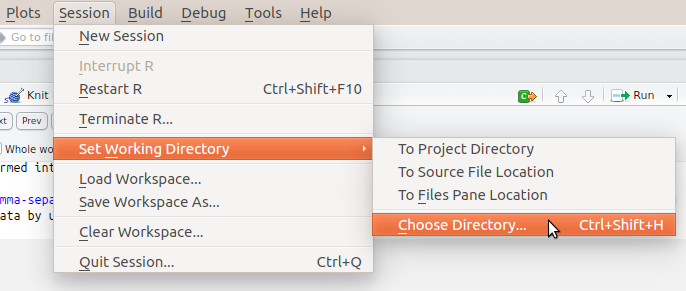

  
# {.tabset .tabset-fade .tabset-pills}
  
```{r setup, include=FALSE}
knitr::opts_chunk$set(echo = TRUE)
```

## Working with Real Data Sets

### Getting started

Make sure to load the `tidyverse` library so we can do plotting later on.
```{r, message=FALSE, warning=FALSE}
library(tidyverse)
```

### Example

For this example, you'll need a csv file.  To get it, **right click** on this link: [Guerry.csv](https://raw.githubusercontent.com/cbdavis/DASM/master/2017/data/Guerry.csv) and select **"Save Target As"** or **"Save Link As"** cdto save it to your computer.

Internet Explorer might try to save this as "Guerry.**txt**", make sure to save this as "Guerry.**csv**" or adjust your code so that it knows to read the correct file.

One thing you need to check is your working directory. This is the directory where R looks for any files.  You can set this in RStudio `Session` -> `Set Working Directory` -> `Choose Directory`

<center></center>

Once you've done all this, you can now read in the data file: 
```{r, eval=FALSE}
data1 <- read.csv(file ="Guerry.csv")
```

```{r, echo=FALSE}
data1 <- read.csv(file ="./data/Guerry.csv")
```

Note that every time you read in a .csv file you will have a data frame, even if there is only a single column present.

As mentioned in the previous practicals, we use `summary` to get an idea about what is in the data frame:
```{r}
summary(data1)
```

This data set contains statistics about French cities.  As you can see, there are several different types of columns:

* A few categories: `Region`, `Main_city`
* A few numerical variables: e.g., `Crime_pers`, `Distance`
* A few rank variables: `Donation_clergy`, etc.  These show which city is 1st, 2nd, etc.

If we take a closer look at the results, we see that the `dept` column is numeric since `summary` displays information about the minimum, median, mean, max and quantiles.
```
      dept    
 Min.   :  1.00
 1st Qu.: 24.25
 Median : 45.50
 Mean   : 46.88
 3rd Qu.: 66.75
 Max.   :200.00
```

However, for `Region`, we don't see quantiles, etc but we are looking at counts of values, as this column contains factors indicating the particular region (`C`, `E`, `N`, `S` or `W`).  Also note that `NA's: 1` tells us that we have one `NA` which indicates a missing value (Not Available).  We'll discuss later in more detail how these can be dealt with in R.

```
 Region
C   :17
E   :17
N   :17
S   :17
W   :17
NA's: 1
```
The data you have just loaded in is from the Guerry R package, so to get an idea about the variables we need to install the package:
```{r, eval=FALSE}
install.packages("Guerry")
```

Load the library:
```{r}
library(Guerry)
```

and then bring up the help information that relates to this specific data frame which is included in the package:
```{r}
help(Guerry)
```

#### Select a numerical variable and plot a histogram

```{r}	
ggplot(data1, aes(x=Infants)) + geom_histogram(bins=50)
```

#### Make a box plot of `Literacy` per city size (`MainCity`) 

```{r}
ggplot(data1, aes(x=MainCity, y=Literacy)) + geom_boxplot()
```

#### Managing outliers

In the plot above, we see that the box for the small cities looks strange as it is quite skewed.  We now take a closer look 

First we want to know how many variables are in the small, medium and large cities:

```{r}
a <- table(data1$MainCity)
a
```

This shows that we have 10 observations for small cities.

Now we use dplyr to make subsets of `data1`

```{r}
small_data <- data1 %>% filter(MainCity ==  "1:Sm") %>% select(Crime_prop)
print(small_data)
```

**TODO** find a home for this section

Regarding `NA` values:

* If you are doing a numeric comparisons (i.e. `hp >= 250`) using the `filter` function, then `NA` values will be filtered out.  
* If you want to do a numeric comparison and also keep `NA` values, then you need to specify something like `hp >= 250 | is.na(hp)`.  The function `is.na()` will return `TRUE` for any `NA` values.


#### Filter outliers and make a boxplot of crime vs city size

From above, we can see that there's a large outlier in the small cities, and this would disturb a test like ANOVA. We need to remove this.

We then use the `filter` function with `dplyr` to keep all rows where we don't have a combination of a small city and a `Crime_prop` greater than 15000.

```{r}
data2 = data1 %>% filter(!(MainCity == "1:Sm" & Crime_prop > 15000))
```

You'll notice that the `filter` statement is a bit more complex this time.  Starting from the middle of the statement:

* `&` is again our logical "and" which means that we're looking for situations where the conditions on either side are both true.
* `MainCity == "1:Sm"` and `Crime_prop > 15000` show that we are trying to match rows where the values meet these conditions.
* Most importantly is the `!` symbol on the outside of this clause, which says that we only want to keep rows that **don't** match the conditions specified in the clause `(MainCity == "1:Sm" & Crime_prop > 15000)`
 
Now we can see that the boxplot looks more reasonable.
```{r}
ggplot(data2, aes(x=MainCity, y=Crime_prop)) + geom_boxplot()
```

#### Select any row and column by indices

**TODO** do we need this section?

You can also create subsets of data frames by using numeric indices that indicate the row and column numbers.  This technique will work with matrices as well.  Note in the examples below that in some cases you're specifying a sequence of numbers (`5:9` = 5,6,7,8,9), while in other cases, you are specifying a set of numbers (`c(1,5,9)` is just the numbers 1, 5 and 9).  You can also mix in the names of the columns with numeric indices as well.

```{r}
b <- data1[1:3, 5:9]
b
c <- data1[c(1,5,9), 7]
c
d <- data1[c(1,5,9),c("Region", "Infants")]
d
```

Note that both `b` and `d` are data frames, although `c` is a vector of integers.

#### Select individual columns
```{r}
x <- data1$Crime_prop
```
or
```{r}
x <- data1$Crime_prop[1:10]  #just select the first 10 rows
```


#### Make the whole data frame into a matrix
```{r}
data1_m <- as.matrix(data1)
```

We can get the total number of all elements in the matrix:
```{r}
length(data1_m)
```

Note that we can't access columns via `$` anymore.  In other words, we can't do `data1_m$Crime_prop`

#### Make a table of city size vs region

**TODO** this was covered in the previous practical

```{r}
tab = table(data1$MainCity, data1$Region)
tab
```

## Dates and Times

### Useful resources: 

* [Working with Time Series Data in R ](http://faculty.washington.edu/ezivot/econ424/Working%20with%20Time%20Series%20Data%20in%20R.pdf)
* [R cheat sheet](http://blog.yhat.com/static/pdf/R_date_cheat_sheet.pdf). The columns for `Date` and `POSIXct` are relevant for this practical.  We don't use the `lubridate` library for this example, although it does similar things.  

### Integers to Dates

Dates, not involving times of the day, are natively stored on your computer as integer numbers with 1 Jan 1970  = 0 and 1 corresponding to 1 day. Due to this, you need to specify `origin="1970-01-01"` in the example below.  

For example, the number 365 corresponds January 1, 1971.  To tell R that a number is a date, not just a number you use the command `as.Date`:
```{r}
as.Date(365, origin="1970-01-01")
```
 
### Strings to Dates
R can also convert strings to dates
```{r}
as.Date("1971-01-01")   # always use the order of year, month, day
```

### Vectors of Date Ranges
You can make vectors filled with series of dates using `seq`
```{r}
t = seq(from = as.Date("2000-11-30"), to = as.Date("2000-12-26"), by="1 day")
t
```

`by=` can be e.g, 1 month, 2 years, 5 days, etc...

Now try to make a weekly time vector from 5 June 2005 to 20 August 2006.  You should see:

```{r, echo=FALSE}
t = seq(from = as.Date("2005-06-05"), to = as.Date("2006-08-20"), by="1 week")
t
```

In general, you can treat date & time vectors as normal vectors, which means that you can use them in plots, add and subtract them, etc.

`POSIXct` does more or less the same as `Date`, but it stores the time variable as numbers of seconds since midnight GMT 1970-01-01.  As a result, this allows us to store data which expresses the time on a specific date.

```{r}
t.str = "2013-12-19 10:17:07"    # default format
t.obj = as.POSIXct(t.str) 
t.obj
```

If you have any other format than default format e.g., if you need to read in data that are not in the default format, then you can give R the format the data are in:

```{r}
t.str1 = "19-12-2013 10:17:07"
t.obj1 = as.POSIXct(t.str1, format="%d-%m-%Y %H:%M:%S")
t.obj1
```

`"%d-%m-%Y %H:%M:%S"` says that we have a time that is specified in the form of day, month and year (separated by `-`) which is then followed by a space and the hours, minutes and seconds (separated by `:`).

To get an overview of all the format types type `help(strptime)`.  Below is a table which summarizes commonly used codes.

| Code | Description              | Example |
|------|--------------------------|---------|
| %a | Abbreviated weekday name | Mon |
| %A | Full weekday name | Monday |
| %b | Abbreviated month name | Jan |
| %B | Full month name | January |
| %c | Date and time. Locale-specific on output, "%a %b %e %H:%M:%S %Y" on input. | |
| %d | Day of the month as decimal number (01–31) | 01 |
| %H | Hours as decimal number (00–23) | 16 |
| %I | Hours as decimal number (01–12) | 08 |
| %j | Day of year as decimal number (001–366) | 234 | 
| %m | Month as decimal number (01–12) | 07 |
| %M | Minute as decimal number (00–59) | 12 | 
| %p | AM/PM indicator | AM |
| %S | Second as integer (00–59) | 35 | 
| %U | Week of the year as decimal number (00–53) using Sunday as the first day 1 of the week (and typically with the first Sunday of the year as day 1 of week 1). The US convention. | |
| %w | Weekday as decimal number (0–6, Sunday is 0). | 1 |
| %W | Week of the year as decimal number (00–53) using Monday as the first day of week (and typically with the first Monday of the year as day 1 of week 1). The UK convention. | | 
| %x | Date. Locale-specific on output, "%y/%m/%d" on input. | | 
| %X | Time. Locale-specific on output, "%H:%M:%S" on input. | |
| %y | Year without century (00–99) | 91 |
| %Y | Year with century | 1991 |
| %z | Signed offset in hours and minutes from UTC, so -0800 is 8 hours behind UTC | |
| %Z | Time zone abbreviation as a character string | PST |

### Changing format of date

You can change the format of the output date using the codes mentioned above.

| Code | Description              | Example |
|------|--------------------------|---------|
| %a | Abbreviated weekday name | Mon |
| %d | Day of the month as decimal number (01–31) | 01 |
| %b | Abbreviated month name | Jan |
| %Y | Year with century | 1991 |

```{r}
t.obj1
format(t.obj1, "%a %d %b. %Y")
```

### Adding and subtracting dates
You can add and subtract POSIXt objects and perform logical operations on them. If you have a vector of POSIXt objects, you can use the `min()`, `max()` and `range()` functions. 

```{r}
t.str2 = "2013-12-19 18:20:07"
t.obj2 = as.POSIXct(t.str2)
```

Subtract two date times:
```{r}
t.obj1 - t.obj2
```

### Exercise 1

Download the [Pr_20May1.csv](https://raw.githubusercontent.com/cbdavis/DASM/master/data/Pr_20May1.csv) to your computer in the same way that you did for the other csv file in this practical.

This data contains a time series of monthly temperature data from Jan. 1946 to Dec. 2014, however the data set you just downloaded only has a single column with the temperatures and does not have a column included which corresponds to these dates.  

Fix this by making a vector with the dates corresponding to each data point, and make a plot of the temperatures over time.

```{r, echo=FALSE}
pr = read.csv("./data/Pr_20May1.csv")
t = seq(from = as.Date("1946-01-01"), to = as.Date("2014-12-01"), by="1 month")
pr$t = t
library(ggplot2)
ggplot(pr, aes(x=t, y=x)) + geom_line()
```

## Managing issues in real data

### Common Issues

When dealing with real data sets, you will commonly run into several issues.  You will often find yourself:

* dealing with NA values
* dealing with strange/unwieldy/messy column names
* dealing with dates

### Inconvenient column names

You may find that the column names for a data frame are excessively long, or may contain extra spaces or strange characters.  You can fix this by using the `colnames` command.

With a hypothetical data frame called `input1`, you can change the first and second column names by doing:

```{r, eval=FALSE}	
colnames(input1)[1] <- "x" 	# gives the first column the name "x"
colnames(input1)[2] <- "y"		# gives the second column the name "y"
```

If there are only two columns in the entire data frame, then you could do:
```{r, eval=FALSE}
colnames(input1) = c("x", "y")
```

If there are more than two columns, then you have to specify the indices, otherwise you will get an error.
```{r, eval=FALSE}
colnames(input1)[c(1:2)] = c("x", "y")
```

### Replacing values with NA 

Real data may often have missing values, which are represented in R as `NA`.  In some data sets you may see them represented in other forms like `NaN` (not a number) or by an unrealistic number (e.g., -999).  For R to handle the missing values, you have to rename them as `NA`, if they are not named like that, then R does not recognize them and will try to process them as an actual number.

Let's say that for a data frame we have called `df`, `NA` values are currently represented as `-999`.  If we type into the console `df == -999`, we'll get a matrix of `TRUE`, `FALSE` or `NA` values (if `NA` is already present).  

To replace these -999 values, we use the command below which says that for all locations in the data frame with a value of -999, we should assign to those locations the value `NA` instead.

```{r, eval=FALSE}	
df[df == -999] <-NA
```

#### Exercise 1

For this exercise, download the [Carbon.csv](https://raw.githubusercontent.com/cbdavis/DASM/master/data/Carbon.csv) data into R as a data frame called `input1`.

```{r, echo=FALSE}
input1 = read.csv("https://raw.githubusercontent.com/cbdavis/DASM/master/2017/data/Carbon.csv")
```

After loading in the csv file into R, try to replace the -999 values with `NA`.  If you run `summary` before the replacement you should see:

```{r, echo=FALSE}
summary(input1)
```

After replacing them, using `summary` you should see that several columns now have `NA` values:
```{r, echo=FALSE}
input1[input1 == -999] <-NA
summary(input1)
```

#### Exercise 2

Using the same `Carbon.csv` data set:

* Make time vector of the date (the `date_start` column).  If you type `class(input1$date_start)` you'll see that it's currently represented as a factor.
* Make a new vector that formats the date, so that it just shows the month (see examples above).  You may also have to use `as.Date()` to convert the `date_start` values from a factor to a Date object.

If you do this correctly, you should see:
```{r}
months = format(as.Date(input1$date_start), "%B")
months
```

We can now add this vector directly to the data frame:
```{r}
input1$months = months
```

### Creating Category Variables
Sometimes real data sets don't directly contain all the information you want.  For example, you have data covering a year and you are wondering if there is a difference between summer and winter, or between day and night; but you only have a vector with date and time.  

We may want to create new category variables which could be useful for ANOVA, box plots, etc.

For this example, assume that `input1$y` varies between 0 and 5.  Given different ranges of `y`, we can specify categories of `"low"`, `"medium"` and `"high"`

```{r, eval=FALSE}
x1 <- c() 	# start with empty vector
x1[input1$y < 1] <- "low"
x1[(input1$y >=1) & (input1$y < 3)] <- "medium"
x1[input1$y>=3] <- "high"
```

`x1` is now a vector of length `input1$y` and consists of values `"low"`, `"medium"`, `"high"`

#### Exercise 3

Using the `Carbon.csv` data set, make a vector that correctly assigns the seasons to your data set (use the meteorological definition of season e.g. winter is dec, jan, feb; spring is mar, apr, may, etc.)

Note that you can use the syntax below for matching text values.  

```{r, eval=FALSE}
x1[input1$y %in% c("big", "large", "enormous")] <- "huge"
```

#### Exercise 4

Now add the vector of months and the vector of seasons to your data frame.
