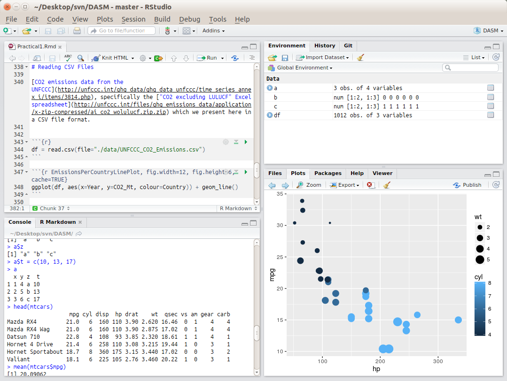
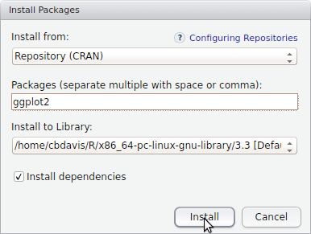
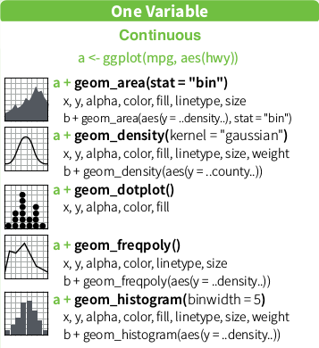
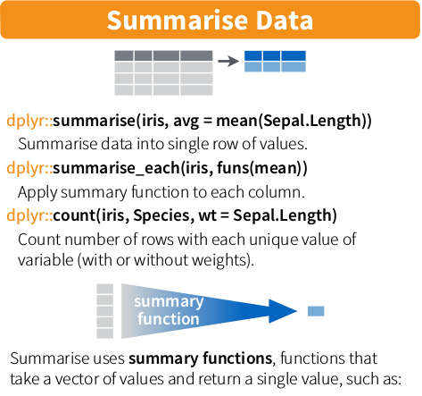

```{r, echo=FALSE, warning=FALSE, message=FALSE}
options(stringsAsFactors = FALSE)
library(knitr)
```

# What/Why?

[R is a language and environment for statistical computing and graphics.](https://www.r-project.org/about.html).  In more practical terms:

* It's a **digital swiss army knife**
* It's **free** - just download and get started, no license, no trial period
* There's a **huge community** behind it
    * For even the weirdest problems you run into, you can Google it and usually find a solution (probably on [stackoverflow](http://stackoverflow.com/questions/tagged/r)). 
* You don't have write to code that others have already created (stand on the shoulders of giants)
    * There are over **[9000 contributed packages covering a variety of topics](https://cran.r-project.org/web/views/)**. This means that for a lot of different applications and scientific domains, someone has already created something that you can re-use. This minimizes the amount of work you have to do, while allowing you to do much more sophisticated analysis.
    * **Package management** - you don't have to copy/paste this code. It's managed so that you just have to call the name of the package. You can also have R update every single package that you have installed, in order to get the latest bug fixes, enhancements, etc. 
* It lets you create **repeatable workflows**
    * Have new data? Just run the code again to generate plots + images for reports
* Use of **open source & open standards**
    * Researchers can inspect the source code and report errors to the developers, meaning that the process of finding and fixing bugs in the software is more transparent and efficient.
    * Open standards allow for data portability between a variety of programs, so you're not limited to just using proprietary programs. This can give you greater flexibility in the types of tools you use.

You're already used to programming since **[spreadsheets are code](http://www.slideshare.net/Felienne/spreadsheets-are-code-online)**:

```{Excel}
=SUM(OFFSET($data.$A$1,MATCH($T197,$data.$C$1:$C$1048576,0)-1,MATCH($AL$7&$AL$6,$data.$A$1:$AMJ$1,0)-29,1,2))/1000+SUM(OFFSET($data.$A$1,MATCH($T197,$data.$C$1:$C$1048576,0)-1,RIGHT(V$53,2)*8-7,1,2))/1000-SUM(OFFSET($data.$A$1,MATCH($T197,$data.$C$1:$C$1048576,0)-1,MATCH($AL$7&$AL$6,$data.$A$1:$AMJ$1,0)-37,1,2))/1000
```

This is a formula from an actual spreadsheet in use by a company.  This code is a nightmare to maintain and it's very difficult to check if there are any errors in it.  Spreadsheets create a soup of data storage, processing and presentation (i.e. numbers, formulas and graphs).  This hinders transparency and as spreadsheets get more complex, it becomes very difficult to trace how the data analysis is actually done.  With R, it's possible to use code to read from data files and then **[automatically generate reports in the form of Word documents, pdfs, or html pages](http://rmarkdown.rstudio.com/)**. Separating your data, processing and presentation of results into separate components will help you to stay organized.

# First Steps:

## Setting up R and RStudio

You need to have both R and RStudio set up.  You can use R without RStudio, but if you do, the interface will look like the one on the left image below, and this can be a bit intimidating.  RStudio runs on top of R and provides a more visual interface, in addition to greatly assisting you with various aspects of programming.

<center>
<table>
<tr>
<th><h3>R</h3></td>
<th></td>
<th><h3>R + RStudio</h3></td>
<tr>
<td></a></td>
<td style="width:100px"><center><b><h3>vs.</h3></b></center></td>
<td></a></td>
</tr>
</table>
</center>

### University Computer
On the university computers you should be able to find RStudio in the Start Menu by looking for `Mathematics & Statistics` -> `R`.  If there are several versions, just pick the one with the highest version number.  **You should not have to install R or RStudio on the university computers.**

### Personal Computer
On your own computer you will have to **install both R and RStudio**

* Download and install R for either [Windows](https://cran.r-project.org/bin/windows/base/), [Mac OS X](https://cran.r-project.org/bin/macosx/) or [Linux](http://www.jason-french.com/blog/2013/03/11/installing-r-in-linux/)
* [Download and install RStudio](https://www.rstudio.com/products/rstudio/download/)

### Open RStudio

Once you open up RStudio, you'll see that it has four panels, which are:

**Top Left** - Code - here you can open and work on different script files

**Top Right** - Environment/History

* This shows all the variables and functions that are currently loaded in the workspace (the "**Environment**")
* You can click on the variables to see their values, which can be useful to inspect how the code is operating.
* The **History** shows all of the commands that you have run.

**Bottom Left** - Console

* R commands can be run here
* You can also find documentation for commands by typing in ?commandName to get help, i.e. if you type `?sum` you'll see the documentation for the `sum` function.

**Bottom Right** - Files/Plots/Packages/Help

* **Files** - This shows everything in your current working directory
* **Plots** - Once you start plotting, multiple plots will be stored here.  There are arrows in this view that allow you to navigate  between multiple plots
* **Packages** - Shows all the packages installed and currently loaded
* **Help** - Shows documentation for various functions.  

You can run lines of code by highlighting them, and then clicking on "Run" above.
You can run all the code at once by doing Code -> Run Region -> Run All

### Install Required Packages

Once R and RStudio is installed, **open up RStudio and install the necessary packages for R**.  Note that with R, the word "package" and "library" are often used interchangeably.  Today we'll need to install the [ggplot2](http://docs.ggplot2.org/current/) library to do the plotting.


#### Installation Steps

* In the bottom right quadrant of RStudio, locate the `Packages` tab, and click on `Install`:

<center></center>

* Then type in the name of the package `ggplot2`.  You should see it auto-complete as you type:

<center></center>

* Click on `Install` and make sure that `Install dependencies` is checked:

<center></center>

* You should then see statements like this in the console on the bottom left quadrant:

<center></center>

* As you can see in the console, you can also install packages just by typing:

```{r, eval=FALSE}
install.packages("ggplot2")
```

# How to read this tutorial
Everything shown in the large gray boxes below is code that you can run by copy/pasting into the `Console` tab in RStudio. For example:

```{r}
print("hello world")
```

You can also collect these statements in a new R file (`File` -> `New File` -> `R Script`) which you can then run.

If you do create a new R file, you can run the code by selecting one of the options under the `Run` button:
<center></center>

Gray bits of text `like this` usually refer to individual R commands, package names, or the exact name of things that you will see in the user interface.

## Always always always first specify `options(stringsAsFactors = FALSE)`
Make sure to always run this command when you start using R:
```{r}
options(stringsAsFactors = FALSE)
```

We'll cover what this is in a later practical, but for now it's important to specify the `stringsAsFactors` option whenever running code as you may get confusing results without it.  In short, [R assumes that your data contains factors or categorical variables](http://www.stat.berkeley.edu/classes/s133/factors.html), which isn't necessarily the case.

## Assinging values to variables.

We can assign the value of `1` to the variable `a` by doing:
```{r}
a = 1
```

And then can make sure that the value has been assigned:
```{r}
a
```

Instead of using `=`, we can also use `<-` which does the same thing.  You often will see people use both forms of these.
```{r}
a <- 1
```

Although you assigned a number to the variable `a`, you can also assign to it different types of data like text:
```{r}
a = "this is some text"
a
```

## Vectors

```{r}
a  = c(3, 4, 5, 6, 7)
a
```

Since this is a sequence from 3 to 7, we can also write it like:

```{r}
a  = c(3:7)
a
```

## Matrices

Initialize a matrix of zeros with three columns and two rows.  Then set the value at row 1 and column 2 to `3`
```{r}
b = matrix(0, ncol=3, nrow=2)
b[1,2] = 3
b
```

You can append a matrix to the end of another matrix using `rbind` which means that you will bind the rows together.
```{r}
b = matrix(0, ncol=3, nrow=2)
c = matrix(1, ncol=3, nrow=2)
d = rbind(b,c)
d
```

You can also bind the columns together using `cbind`
```{r}
cbind(b,c)
```

R also has functions that run operations such as `mean` and `sum` on matrix rows and columns:
```{r}
rowMeans(d)
rowSums(d)
colMeans(d)
colSums(d)
```

## Data Frames
Data frames are conceptually similar to matrices, although you can mix in different types of data per column.  In the example below, the first two columns are numbers, while the last column is text.

```{r}
a = data.frame(x = c(1:3),
               y = c(4:6),
               z = c("a", "b", "c"))
a
```

Data frames are similar to matrices in that you can access elements based on their row and column indices.  For example, to get the element in the 2nd row and third column:
```{r}
a[2,3]
```

We can also get just the 2nd row:
```{r}
a[2,]
```

Or just the 3rd column:
```{r}
a[,3]
```

One of the nice things about data frames is that you can use the names of the columns (combined with the `$` sign) to directly access the values in that column.  So if we want to see the values of only the `z` column, we can use `a$z`

```{r}
a$z
```

You can also add a new column to an existing data frame:
```{r}
a$t = c(10, 13, 17)
a
```

We'll look at the `mtcars` data set that is included with R.  If you type `?mtcars` in the console, you'll see more documentation.  Looking at the first few lines of the `mtcars` data frame, we see the following which shows data in several columns: `mpg`, `cyl`, `disp`, `hp`, `drat`, `wt`, `qsec`, `vs`, `am`, `gear` and `carb`
```{r}
head(mtcars)
```

The `head` command just shows us the top few rows, and you can also use the `tail` command to look at the bottom rows.

For specific columns, we can use the `mean` and `sd` functions to find the average and standard deviation.
```{r}
mean(mtcars$mpg)
sd(mtcars$mpg)
```

# Creating Plots

We first need to load the library that we'll be using for the rest of this tutorial:

```{r, message=FALSE}
library(ggplot2)
```

## ggplot2
Many visualizations created with R are often created using the **[ggplot2 library](http://ggplot2.org/)**.  What's interesting about this library is that way in which it allows you to construct visualizations.  The gg in ggplot2 stands for the Grammar of Graphics. The idea is that when you create plots, you are basically writing sentences that are of the form:
  
  `Here's my data frame` + `Here are the x and y columns` + `Apply this kind of plot to that data` + `These are the axis labels` + `here are some more additional transformations`

The syntax may look strange at first, although it’s a very modular approach, and you can create very complex visualizations just by adding new parts to these sentences.

## Scatter plot
To understand this, we can first do a simple scatter plot.  You'll notice with the syntax that we first start with the `mtcars` data frame, then we specify which columns are to be associated with the `x` and `y` values, and then we specify that we want to plot the data as points by adding `+ geom_point()`.

```{r mtcarsGeomPoint, cache=TRUE}
ggplot(mtcars, aes(x=hp, y=mpg)) + geom_point()
```

In the following examples, you may see the code examples split over multiple lines.  The two statements below are actually equivalent, but by spreading the commands over multiple lines it can sometimes help to make things more readable by separating the code into its different functional pieces.

```{r, eval=FALSE}
ggplot(mtcars, aes(x=hp, y=mpg)) + geom_point()

ggplot(mtcars, 
       aes(x=hp, y=mpg)) + 
  geom_point()
```

We can also use values from other columns to modify particular attributes of the points.  For example, we can set the color of the points to indicate the number of cylinders
```{r mtCarsPointColor, cache=TRUE}
ggplot(mtcars, aes(x=hp, y=mpg, colour=cyl)) + geom_point()
```

We can set the size of the points based on the weight of the car
```{r mtCarsColorSizePoint, cache=TRUE}
ggplot(mtcars, aes(x=hp, y=mpg, colour=cyl, size=wt)) + geom_point()
```

## Boxplot
For this example, we need to specify `x=factor(cyl)` to make sure that there is a boxplot drawn for each unique value of `cyl`.

```{r mtCarsBoxPlot, cache=TRUE}
ggplot(mtcars, aes(x=factor(cyl), y=mpg)) + geom_boxplot()
```

## Histogram
Histogram of the number of cars with a particular fuel economy value:

```{r mtCarsHistorgram, cache=TRUE}
ggplot(mtcars, aes(x=mpg)) + geom_histogram()
```

We can also change the bin width:
```{r mtCarsHistorgram2, cache=TRUE}
ggplot(mtcars, aes(x=mpg)) + geom_histogram(binwidth=5)
```

## Bar charts
Count the number of cars with specific numbers of cylinders
```{r mtCarsBarChart, cache=TRUE}
ggplot(mtcars, 
       aes(x=cyl)) + 
  geom_bar()
```

## Pie chart

Pie charts can be created as well, although they require a few more steps.  Part of the reason for this is that [many data visualization experts discourage their use](https://www.quora.com/How-and-why-are-pie-charts-considered-evil-by-data-visualization-experts) since other types of visualizations can communicate the information more effectively.

The general strategy to create a pie chart using ggplot2 is to first create a bar chart and then to use polar coordinates to turn the bars into a circle.

In other words, we start with this:
```{r mtCarsNotYetPieChart, cache=TRUE}
ggplot(mtcars, 
       aes(x=factor(1), fill=factor(cyl))) + 
  geom_bar(width=1)
```

To explain what's going on:

* `x=factor(1)` - This places the bars at the same location, which allows them to be stacked
* `fill=factor(cyl)` - The fill color for the bars is based on the value of `cyl`
* `geom_bar(width=1)` - This is needed to that there isn't a hole in the plot when we use the code in the step below.
* **Note:** the height of the bars is counting the number of cars (i.e. number of rows in the `mtcars` data frame) with a specific value for `cyl`.  In other words, the size of the pie slices is not based on actual numeric values in `mtcars`.

We then turn this into a pie chart by adding `+ coord_polar(theta="y")`:
```{r mtCarsPieChart1, cache=TRUE}

# this does a count
ggplot(mtcars, 
       aes(x=factor(1), fill=factor(cyl))) + 
  geom_bar(width=1) + coord_polar(theta="y")
```

If we want to create a pie chart where the size of the slices correspond to actual values in the data and not just to counts of things with the same values, we need to take a slightly different approach.

Here we have a data frame listing types of animals and values associated with them:
```{r animalsDataFrame, cache=TRUE}
animals = data.frame(animal_type = c("chickens", "cows", "pigs"),
                     farm_count = c(20, 10, 5))
animals
```

We then add `y=farm_count` and `stat="identity"` to make sure that this is plotted correctly.  We also use `theme_void()` to remove the axis labels that we saw in the previous plot.

Using `stat="identity"` means that the size of the pie slices are based on the values contained in the data, and not on the count of things with the same values.

```{r mtCarsPieChart2, cache=TRUE}
ggplot(animals, 
       aes(x=factor(1), y=farm_count, fill=factor(animal_type))) + 
  geom_bar(width=1, stat="identity") + 
  coord_polar(theta="y") + 
  theme_void()

```

# Reading CSV Files

The following example is based on [CO2 emissions data from the UNFCCC](http://unfccc.int/ghg_data/ghg_data_unfccc/time_series_annex_i/items/3814.php), specifically the ["CO2 excluding LULUCF" Excel spreadsheet](http://unfccc.int/files/ghg_emissions_data/application/x-zip-compressed/ai_co2_wolulucf.zip.zip) which we've transformed into a CSV file.

CSV stands for ["comma-separated values"](https://en.wikipedia.org/wiki/Comma-separated_values) which means that you represent tabular data by using commas to separate values from different columns:

```{csv}
animal,farm_count
chickens,20
cows,10
pigs,5
```

While you can technically read Excel files into R, reading CSV files is much much faster as it is a very simple data format.

Now we'll load in an example data file and create several plots with it.

For this, you'll need the UNFCCC_CO2_Emissions.csv file.  To get it, **right click** on this link: [UNFCCC_CO2_Emissions.csv](https://raw.githubusercontent.com/cbdavis/DASM/master/data/UNFCCC_CO2_Emissions.csv) and select **"Save Target As"** or **"Save Link As"** to save it to your computer.

Internet Explorer might try to save this as "UNFCCC_CO2_Emissions.**txt**", make sure to save this as "UNFCCC_CO2_Emissions.**csv**" or adjust your code so that it knows to read the correct file.

One thing you need to check is your working directory. This is the directory where R looks for any files.  You can set this in RStudio `Session` -> `Set Working Directory` -> `Choose Directory`

<center></center>

Make sure that this is set to the directory where you have placed the `UNFCCC_CO2_Emissions.csv` file.

```{r, eval=FALSE}
df = read.csv(file="UNFCCC_CO2_Emissions.csv")
```

```{r, echo=FALSE}
df = read.csv(file="./data/UNFCCC_CO2_Emissions.csv")
```

Create line plots per country of the amount of CO2 emissions:
```{r EmissionsPerCountryLinePlot, fig.width=12, fig.height=6, cache=TRUE}
ggplot(df, aes(x=Year, y=CO2_Mt, colour=Country)) + geom_line()
```

Create a stacked area chart showing how each country's CO2 emissions contributes to the total:
```{r EmissionsPerCountryArea, fig.width=12, fig.height=6, cache=TRUE}
ggplot(df, 
       aes(x=Year, y=CO2_Mt, fill=Country)) + 
  geom_area()
```

Same plot, but using `geom_line(aes(ymax=CO2_Mt), position="stack", size=0.1)` to add black lines to help better distinguish the individual countries.

```{r EmissionsPerCountryAreaWithSeparatingLine, fig.width=12, fig.height=6, cache=TRUE}
ggplot(df, 
       aes(x=Year, y=CO2_Mt, fill=Country)) + 
  geom_area() + 
  geom_line(aes(ymax=CO2_Mt), position="stack", size=0.1)
```

In the previous plots, it's a bit difficult to distinguish countries with similar colors.  We can also use `facet_wrap` to create plots for individual countries.

* `~Country` - create individual plots per distinct values in the `Country` column.
* `scales="free_y"` - each plot will have its y axis scaled individually.  This helps to view the trends from countries with less CO2 emissions.

```{r EmissionsPerCountryFacetWrap, fig.width=12, fig.height=10, cache=TRUE}
ggplot(df, aes(x=Year, y=CO2_Mt)) + geom_line() + facet_wrap(~Country, scales="free_y")
```

The plot above shows the variation, but you'll notice that the minimum value on the y scale is not set to zero.  This means that the variation observed may not actually be that big when considering the overall amount of emissions.  To fix this, we update our code to use `ymin=0` so that we can get a picture of the absolute magnitude of emissions.

```{r EmissionsPerCountryFacetWrapYmin0, fig.width=12, fig.height=10, cache=TRUE}
ggplot(df, aes(x=Year, y=CO2_Mt, ymin=0)) + geom_line() + facet_wrap(~Country, scales="free_y")
```

# Reference Materials
For further information beyond what is covered in this practical, you can refer to the resources below.  If you are having trouble understanding the contents of the practical, these can be quite useful.

## Cheat sheets

**These sheets are important and summarize much of what you will need to know about R for this course**

* [R Cheat Sheet](https://www.rstudio.com/wp-content/uploads/2016/06/r-cheat-sheet.pdf) - this covers many of the basics of using R that you will need to know.
* [Data Visualization with ggplot2 Cheat Sheet](https://www.rstudio.com/wp-content/uploads/2015/03/ggplot2-cheatsheet.pdf) - this covers all the types of visualizations that can be done with `ggplot2`
* [Data Wrangling with dplyr and tidyr Cheat Sheet](https://www.rstudio.com/wp-content/uploads/2015/02/data-wrangling-cheatsheet.pdf) - this shows how you can use `dplyr` for reshaping, combining, grouping, and summarizing data frames.  We will cover `dplyr` in a later practical.

<center>
<table>
<tr>
<td style="text-align:center"><b>R cheat sheet</b></td>
<td style="width:50px"></td>
<td style="text-align:center"><b>ggplot2 cheat sheet</b></td>
<td style="width:50px"></td>
<td style="text-align:center"><b>dplyr cheat sheet</b></td>
</tr>

<tr>
<td><a href="https://www.rstudio.com/wp-content/uploads/2016/06/r-cheat-sheet.pdf">
</a></td>
<td style="width:50px"></td>
<td><a href="https://www.rstudio.com/wp-content/uploads/2015/03/ggplot2-cheatsheet.pdf"></a></td>
<td style="width:50px"></td>
<td><a href="https://www.rstudio.com/wp-content/uploads/2015/02/data-wrangling-cheatsheet.pdf"></a></td>
</tr>
</table>
</center>

## Additional Materials

* [How to Transition from Excel to R](https://districtdatalabs.silvrback.com/intro-to-r-for-microsoft-excel-users)
* [R for Excel Users](http://www.rforexcelusers.com/)
* [Quick-R](http://www.statmethods.net/index.html)

For a more basic step-by-step introduction, you can install the [swirl](http://swirlstats.com/students.html) package:
```{r, eval=FALSE}
install.packages("swirl")
```

You can then work through tutorials by doing:
```{r, eval=FALSE}
library(swirl)
swirl()
```

Swirl is interesting since it guides you in learning R, within the R console.  You'll see examples like this:
```{eval=FALSE}
| To assign the result of 5 + 7 to a new variable called x, you type x <- 5 +
| 7. This can be read as 'x gets 5 plus 7'. Give it a try now.
```
