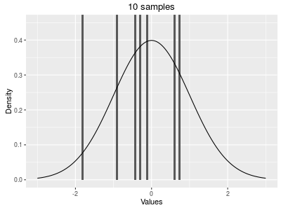

```{r setup, include=FALSE}
knitr::opts_chunk$set(echo = TRUE)
```


```{r, echo=FALSE, message=FALSE}
library(animation)
```

Load libraries and `stringsAsFactors = FALSE`
```{r}
library(ggplot2)
options(stringsAsFactors = FALSE)
```

### TODO need to cover

* Probability distributions (binomial, poisson, normal)
    * (density, cumulative, quartiles, random number) 
* Plot distributions
    * http://www.cookbook-r.com/Graphs/Plotting_distributions_(ggplot2)/
* confidence intervals
    * http://docs.ggplot2.org/0.9.3.1/stat_smooth.html
* Sets? - could show union, intersection, setdiff, not sure if this applies to the examples.
* Venn diagram package for R?


Also important to get the lower and upper tail - could get weird results based on what they choose


# Distributions and their functions
Type `?Distributions` in RStudio in order to see documentation on all of the distributions

<center>
<table width=400><tr><td>
|          | Random<br>Variates | Density<br>Function | Cumulative<br>Distribution | Quantile |
|----------+-----------------+------------------+-------------------------+----------|
| Normal   | `rnorm`         | `dnorm`          | `pnorm`                 | `qnorm`  |
| Poison   | `rpois`         | `dpois`          | `ppois`                 | `qpois`  |
| Binomial | `rbinom`        | `dbinom`         | `pbinom`                | `qbinom` |
| Uniform  | `runif`         | `dunif`          | `punif`                 | `qunif`  |
</td></tr></table>
*Source: [Base R Cheat Sheet](https://www.rstudio.com/wp-content/uploads/2016/06/r-cheat-sheet.pdf)*
</center>

(Show how they change with more samples, animation)

set.seed(12345)
hist(rnorm(10000), breaks=100)
set.seed(12345)
hist(rnorm(100000), breaks=100)

# Sampling

## Permutations (ordered sample)

### With replacement

Choose k samples from n total objects in $n^{k}$ ways.


### Without replacement


```{r}
n = 5
k = 2
factorial(n) / factorial(n - k)

```

$$ \binom{n}{k} = \frac{n!}{(n-k)!} $$

factorial(n) / factorial(k)*factorial(n - k)


## Combinations (unordered sample)

$$ \binom{n}{k} = \frac{n!}{k!(n-k)!} $$


# Distributions

show this as what we should get, as increase samples, get closer to this
```{r animatedHistogram, cache=TRUE, warning=FALSE, message=FALSE, echo=FALSE, include=FALSE}
x = seq(-3,3,0.01)
density = dnorm(x)
density_df = data.frame(x=x, 
                        y=density)

point_steps = c()
for (i in c(1:5)){
  point_steps = c(point_steps, c(1:10)*10^i)
}

saveGIF({  
  for (number_of_points in point_steps){

  set.seed(12345)
  df = data.frame(vals = rnorm(number_of_points))
  
  p = ggplot() + 
    geom_histogram(data=df, aes(x=vals, y = ..density..), bins=100) + 
    geom_line(data=density_df, aes(x=x, y=density)) + 
    coord_cartesian(xlim=c(-3,3), ylim=c(0,0.45)) + 
    xlab("Values") + ylab("Density") + ggtitle(paste(format(number_of_points, scientific=FALSE), "samples"))

  print(p)
  }
}, interval = 0.1, movie.name = "SampleDistributions.gif", ani.width = 400, ani.height = 300)

```

 

Show cumulative sum on distribution?  Show different ways of deriving things

Visual explanation of Bayes?

# Bayes Theorem

$$ P(A|B) = \frac{P(B|A)P(A)}{P(B)} $$ 

* Event A: cow has BSE, $P(A)$=0.01
* Event B: test is positive
* $P(B|A)$ = 0.9 accuracy (= test is positive, if the cow is infected)
* $P(B|A^{c})$ = 0.1 false positives (= test is positive, if the cow is not infected)

What is the chance that B is positive on a randomly chosen cow?
0.01*0.9 + 0.99*0.1 = 0.108


TODO show Bayes with raw data - just a data frame

This gray box represents 100% of the population of cows:

```{r BayesStep1, fig.width=4, fig.height=2.5, echo=FALSE}
ggplot() + 
  geom_rect(data=data.frame(xmin=0, ymin=0, xmax=1, ymax=1), 
            aes(xmin=xmin, xmax=xmax, ymin=ymin, ymax=ymax), fill="gray") + 
    theme_void() + 
    geom_text(aes(x = 0.5, y = 0.5, label = "All Cows"))
```

We know that 1% of the cow population has BSE:

```{r BayesStep2, fig.width=4, fig.height=2.5, echo=FALSE}
offset_BSE = sqrt(0.01)

xmin_BSE = 0.5 - offset_BSE/2
ymin_BSE = 0.5 - offset_BSE/2
# cover up 0.08964

ggplot() + 
  geom_rect(data=data.frame(xmin=0, ymin=0, xmax=1, ymax=1), 
            aes(xmin=xmin, xmax=xmax, ymin=ymin, ymax=ymax), fill="gray") + 
  geom_rect(data=data.frame(xmin=xmin_BSE, ymin=ymin_BSE, 
                            xmax=xmin_BSE + offset_BSE, 
                            ymax=ymin_BSE + offset_BSE), 
            aes(xmin=xmin, xmax=xmax, ymin=ymin, ymax=ymax), color="#0000FF77", fill="#0000FF77") + 
    theme_void() + 
    geom_text(aes(x = 0.5, y = 0.75, label = "All Cows")) +
    geom_text(aes(x = xmin_BSE + offset_BSE/2, y = ymin_BSE + offset_BSE/2, label = "BSE"))
```

But we also know that there are a lot of positive results:

```{r BayesStep3, fig.width=4, fig.height=2.5, echo=FALSE}
offset_Positive = sqrt(0.108)

xmin_Positive = 0.5 - offset_Positive/2
ymin_Positive = 0.5 - offset_Positive/2

ggplot() + 
  geom_rect(data=data.frame(xmin=0, ymin=0, xmax=1, ymax=1), 
            aes(xmin=xmin, xmax=xmax, ymin=ymin, ymax=ymax), fill="gray") + 
  geom_rect(data=data.frame(xmin=xmin_Positive, ymin=ymin_Positive, 
                            xmax=xmin_Positive + offset_Positive, 
                            ymax=ymin_Positive + offset_Positive), 
            aes(xmin=xmin, xmax=xmax, ymin=ymin, ymax=ymax), color="#FF000077", fill="#FF000077") + theme_void() + 
    geom_text(aes(x = 0.5, y = 0.75, label = "All Cows")) +
    geom_text(aes(x = 0.5, y = 0.5, label = "Positive Tests"))
```

Just from this, we can see that there are way more positive test results than the number of cows which have BSE, and therefore, getting a positive result may not be a good indication that the cow actually has BSE.

Combining everything together, we get the image shown below.  As you can see, if a cow actually has BSE, then there is a high probability that the test will spot it.  However, since most cows are not infected (99%) and we know that there is a ten percent chance of false positives, this results in a large part of the population that gets positive test results, but actually doesn't have BSE.

A 10% false positive rate (tests positive, no BSE) is actually quite high, when the size of the true positive (tests positive, has BSE) population is much smaller than the false positive rate.

```{r BayesStep4, fig.width=4, fig.height=2.5, echo=FALSE}
offset_BSE = sqrt(0.01)
offset_Positive = sqrt(0.108)

xmin_Positive = 0.5 - offset_Positive/2
ymin_Positive = 0.5 - offset_Positive/2

xmin_BSE = xmin_Positive - (0.1-0.08964)
#ymin_BSE = 0.5 - offset_BSE/2
ymin_BSE = ymin_Positive
# cover up 0.08964

ggplot() + 
  geom_rect(data=data.frame(xmin=0, ymin=0, xmax=1, ymax=1), 
            aes(xmin=xmin, xmax=xmax, ymin=ymin, ymax=ymax), fill="gray") + 
  geom_rect(data=data.frame(xmin=xmin_BSE, ymin=ymin_BSE, 
                            xmax=xmin_BSE + offset_BSE, 
                            ymax=ymin_BSE + offset_BSE), 
            aes(xmin=xmin, xmax=xmax, ymin=ymin, ymax=ymax), color="#0000FF77", fill="#0000FF77") + 
  geom_rect(data=data.frame(xmin=xmin_Positive, ymin=ymin_Positive, 
                            xmax=xmin_Positive + offset_Positive, 
                            ymax=ymin_Positive + offset_Positive), 
            aes(xmin=xmin, xmax=xmax, ymin=ymin, ymax=ymax), color="#FF000077", fill="#FF000077") + theme_void() + 
    geom_text(aes(x = 0.5, y = 0.75, label = "All Cows")) +
    geom_text(aes(x = 0.5, y = 0.5, label = "Positive Tests")) + 
    geom_text(aes(x = xmin_BSE + offset_BSE/2, y = ymin_BSE + offset_BSE/2, label = "BSE"))
```

**TODO** show different falues for positive/false positives

What if we had different values for the probability that the test was accurate (i.e. different values for $P(B|A)$ and $P(B|A^{c})$)?

We still have the same probability of a cow having BSE, so we keep $P(A)$=0.01.

We need to calculate again $P(B)$ which is the probabilitiy of getting a positive result independent of whether the cow has BSE or not.

In R, we represent $P(B|A)$ as the variable `p_B_given_A` and we make a sequence from 0 to 100, which indicates a range of values for the test being 0% accurrate all the way up to 100% accurate at spotting BSE given that the cow actually has BSE.

$$ P(A|B) = \frac{P(B|A)P(A)}{P(B)} $$ 


```{r}
# probability has BSE
p_A = 0.01

# probability tests positive given has BSE (i.e. how accurate the test is if you have BSE)
p_B_given_A = seq(0.8,1,0.005)

# probability that the test is positive (independent of if you have BSE or not)
p_B = (p_A * p_B_given_A) +  # probability that the test is positive if you have BSE
  ((1-p_A) * (1-p_B_given_A))  # probability that the test is positive if you don't have BSE

df = data.frame(p_A = p_A,
                p_B_given_A = p_B_given_A,
                p_B = p_B)

df$p_A_given_B = (df$p_B_given_A * df$p_A) / df$p_B

head(df)

ggplot(df, aes(x=p_B_given_A, y=p_A_given_B)) + 
  geom_point() + 
  xlab("P(B|A) = P(Positive Test Results|Has BSE)\nIf the cow has BSE, probability of spotting it with the test") + 
  ylab("P(A|B) = P(Has BSE|Positive Test Results)\nIf cow has positive test results, probability that it actually has BSE")

```

Let's translate this into cows now.  There are four different situations that a cow can be in as shown in the code below:

```{r}
numCows = 10000 # we have a lot of cows

n_cows_with_BSE = numCows * df$p_A
n_cows_without_BSE = numCows * (1 - df$p_A)

# Cow tests positive and has BSE
positive_has_BSE = df$p_B_given_A * n_cows_with_BSE

# Cow tests negative and has BSE
negative_has_BSE = (1 - df$p_B_given_A) * n_cows_with_BSE

# Cow tests positive and doesn't have BSE
positive_doesnt_have_BSE = (1 - df$p_B_given_A) * n_cows_without_BSE

# Cow tests negative and doesn't BSE
negative_doesnt_have_BSE = df$p_B_given_A * n_cows_without_BSE
```

Now we use `rbind` and `cbind` to create a data frame which we can then plot.  To give an example, the code below create s a matrix with three columns, where the first is the vector `p_B_given_A` which indicates the probability of if the cow has BSE, that the test will be positive. The second column is the vector `positive_has_BSE`, and the third is a column that just repeats the text `"Test +, has BSE"`

```{r, eval=FALSE}
cbind(p_B_given_A, positive_has_BSE, "Test +, has BSE")
```

```{r, echo=FALSE}
head(cbind(p_B_given_A, positive_has_BSE, "Test +, has BSE"))
```

We then use `rbind` to stack up all these matrices on top of each other into one giant matrix with two columns:

```{r}
has_BSE_results = rbind(cbind(p_B_given_A, negative_has_BSE, "Test -, has BSE"),
                        cbind(p_B_given_A, positive_has_BSE, "Test +, has BSE"))

no_BSE_results = rbind(cbind(p_B_given_A, negative_doesnt_have_BSE, "Test -, no BSE"), 
                       cbind(p_B_given_A, positive_doesnt_have_BSE, "Test +, no BSE"))

# convert this into a data frame
has_BSE_results = as.data.frame(has_BSE_results)
no_BSE_results = as.data.frame(no_BSE_results)

# add columns to the data frame
colnames(has_BSE_results) = c("test_accuracy", "number_of_cows", "results_type")
colnames(no_BSE_results) = c("test_accuracy", "number_of_cows", "results_type")
```

You'll notice that there's one thing we need to fix here:

```{r}
head(has_BSE_results$test_accuracy)
```

The numbers have quotes around them, which means that R thinks that they are characters.  We need to fix this for the first two columns:

```{r}
has_BSE_results$test_accuracy = as.numeric(has_BSE_results$test_accuracy)
has_BSE_results$number_of_cows = as.numeric(has_BSE_results$number_of_cows)

no_BSE_results$test_accuracy = as.numeric(no_BSE_results$test_accuracy)
no_BSE_results$number_of_cows = as.numeric(no_BSE_results$number_of_cows)

```

Now we can plot things:
```{r}
ggplot(has_BSE_results, aes(x=test_accuracy, y=number_of_cows, fill=results_type)) + geom_area()

ggplot(no_BSE_results, aes(x=test_accuracy, y=number_of_cows, fill=results_type)) + geom_area()
```

The example above used only a few probabilities to make this calculation.  But what if we had to figure out the probabilities from a giant spreadsheet that didn't summarize the probabilities:

```{r}
numCows = 1000

df = data.frame(Cow_ID = paste("cow", c(1:numCows)), 
                has_BSE = FALSE,
                Test_Results = TRUE)

```

### Old Code - Take out and/or redo these

## Example 1

You observe cars at an intersection: At a usual day 50% go right and 50% go left. Today you walk past quickly and you have time to observe 10 cars. 

* You want to know the chance that x cars will go to the right. What 	distribution do you use with which parameters? 

*Binomial distribution where `p = 0.5` and `n = 10`*

* What is the chance that only 2 will go right? That more than 7  go right?

$$
  P_{B}(x;10,0.5) = \binom{10}{x} 0.5^{x}(1-0.5)^{10-x}
$$

```{r}
x = 2
n = 10
p = 0.5
dbinom(2,10,0.5)
```
$$
x > 7: 	P_{B}(8; 10, 0.5) + P_{B}(9; 10, 0.5) + P_{B}(10; 10, 0.5)
$$

```{r}
dbinom(8,10,0.5) + dbinom(9,10,0.5) + dbinom(10, 10, 0.5)
```

<center>*or*</center>

$$
1 – S_{B}(7; 10, 0.5)
$$

```{r}
1 - pbinom(7,10,0.5) 
```

* Now you stop and observe 1000 cars: what is the most likely number to do right and what is the standard deviation?

	E(x; n, p) = n*p ; E(x; 1000, 0.5) = 500
	var(x; n, p) = n*p*(1-p)  var(x; 1000, 0.5) = 250, s = 15.81

* You observe 100 cars and see that 43 go to the right? Which uncertainty 	should you quote?

var(x; n, p) = n*p*(1-p)  var(x; 100, 0.5) = 25, s = 5

* What is the chance that this observation was made on a typical day?

$$ P_{B}(x;100,0.5) = \binom{100}{x} 0.5^{x}(1-0.5)^{100-x} $$
$$ X = 43, P_{B} = 0.03, $$
$$ S_{B} = 0.10 (observe\ at\ most\ 43\ cars\ on\ a\ typical\ day) $$


## Example 2
The government says that 26% of the populations smoke. You want to test this by asking 30 of your friends. 

* If this sample is a good representation of the population, how many do you expect to smoke if the government says the truth?

P = 0.26, n = 30
E(x; n, p) = n*p = 7.8 i.e. 7 or 8 people should smoke out of the 30

* Because of the small sample you decide that if 6, 7, 8, or 9 smoke, you believe the government, otherwise you reject – is this a good choice?

if really 26% smoke then the chance that you find 6, 7, 8, or  9 smokers is:
SB(9; 30, 0.26) – SB(5; 30, 0.26) = 0.596

 i.e., even if the government is right you still have ~ 40% chance to find more or less smokes – not a good criterium

* What about trusting the government if 4 – 11 people in the sample smoke?

if really 26% smoke then the chance that you find 4, 5, …, or  11 smokers is:
PB (4; 30, 0.26) + PB(5; 30, 0.26) + … + PB(11; 30, 0.26) = 
= SB(11; 30, 0.26) – SB(3; 30, 0.26) = 0.905

i.e., if the government is right you still have only  ~ 10% chance to find either of 0, 1, 2, 3;  12, 13, …30 smokers. Therefore if you observe any of these numbers there is quite a big chance that the quoted figure of 26% id wrong. 


## Example 3

A large detector is set up to detect neutrinos. It usually counts 2/day. 

* What is the distribution you would use to estimate the probability of counting x neutrinos in a given day?

<center> Poisson, $\mu$ = 2 </center>

$$
P_{p} (x;2) = \binom{2^{x}}{x!}e^{-2}
$$

* What is the probability of detecting 8/day? Are scientists justified in calling this a special event?

1 - Sp(8;2) = 0.00086 or 0.08%

```{r}
ppois(8, lambda=2, lower = FALSE)
```
* What if it counts 4/day?

## Example 4

The weight of young seals follows approximately a normal distribution with mean 150 kg and standard deviation of 10 kg

* What is the probability that a young seal weighs 120kg at the most?

Table lookup:
Z1 = (120 – 150)/10 = -3
Cn(Z1) = 0.0013

```{r}
pnorm(120,mean=150, sd = 10)
```

* What is the  probability that a young seal weighs at  least 125 kg

Table: 
Z2 = -2.5
P(z > Z2) = 1 – P(z<Z2) = 1- 0.0062 = 0.994

```{r}
pnorm(125,mean=150, sd = 10, lower.tail = FALSE)
```

* The heaviest 15% of the seals are classified as overweight? What is the cut-off weight?

Table look up:
 the probability of 0.85 -> find Z
Z = 1.036, -> x = z*10 + 150 = 160.4

```{r}
qnorm(0.85, mean= 150, sd = 10)
```