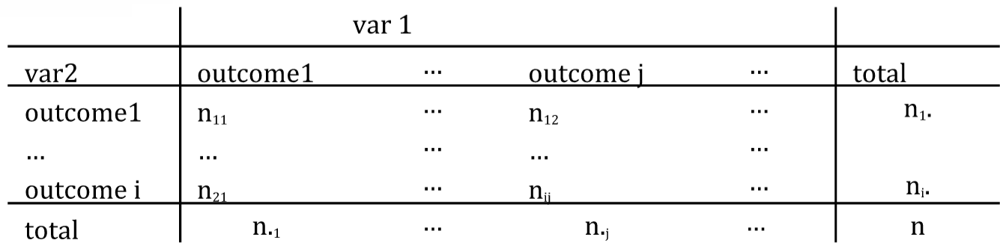

```{r setup, include=FALSE}
knitr::opts_chunk$set(echo = TRUE)
```

```{r, echo=FALSE}
library(ggplot2)
```

# The test for equality in variance

## Review from lecture

A test of s in two different populations with size  $n_1$, $n_2$ involves the following:

1) A confidence level 1-$\alpha$
2) Two independent, random samples of normal distributions
3) Null hypothesis, $H_0$: $s_1 \le s_2$, or $s_1 \ge s_2$, or $s_1 = s_2$
4) Alternative hypothesis, $H_a$: 
    + $s_1 \gt s_2$     (upper tail alternative)
    + $s_1 \lt s_2$     (lower tail alternative)
    + $s_1 \ne s_2$     (two tailed)
5) Test statistic: $F = \frac{{s_{1}}^2}{{s_{2}}^2}$


## Syntax of `var.test`

```{r, eval=FALSE}
var.test(x, y, ratio = 1, 
         alternative = c("two.sided", "less", "greater"),
         conf.level = 0.95, ...)
```

Relevant arguments for this practical:

* `x, y` - numeric vectors of data values
* `ratio`	- the hypothesized ratio of the population variances of x and y.
* `alternative` - a character string specifying the alternative hypothesis, must be one of "two.sided" (default), "greater" or "less". You can specify just the initial letter.
* `conf.level` - confidence level for the returned confidence interval.

## Example 

Take 100 samples from two normal distributions with different mean, but the same variance.  Will the test recognize that we should not reject the null hypothesis?

```{r}
x <- rnorm(100, mean=0)  # if you don’t specify the variance it is set to 1 by default
y <- rnorm(100, mean=1)
```

F test to compare two variances:
```{r}
var.test(x, y, ratio = 1, alternative = "two.sided", conf.level = 0.95)      
```

## Exercise on you own 
* Take 100 random samples from normal distributions with a different variance e.g., `mean = 0`, `sd = 1` and `sd = 1.2` 
 
```{r, echo=FALSE} 
x <- rnorm(100, mean=0, sd=1)  
y <- rnorm(100, mean=0, sd=1.2)
```
 
Run the `var.test` again.  You should see:
```{r, echo=FALSE}
var.test(x, y, ratio = 1, alternative = "two.sided", conf.level = 0.95)
```
* Try both of the examples above again with n = 10

For different means, same variance you should see:
```{r, echo=FALSE}
x <- rnorm(10, mean=0)  # if you don’t specify the variance it is set to 1 by default
y <- rnorm(10, mean=1)
var.test(x, y, ratio = 1, alternative = "two.sided", conf.level = 0.95)
```

For same mean, different variance you should see:
```{r, echo=FALSE}
x <- rnorm(10, mean=0, sd=1)  # if you don’t specify the variance it is set to 1 by default
y <- rnorm(10, mean=0, sd=1.2)
var.test(x, y, ratio = 1, alternative = "two.sided", conf.level = 0.95)
```

# Chi-square test for tabular data

## Preliminaries 

Before we begin constructing tables from categorical data, we should review a few useful functions for working with tabular data.

### Working with table columns

Get a list of columns in a data frame:
```{r}
colnames(iris)
```

Summarize a data frame, showing the columns and statistical information about the values in those columns:
```{r}
summary(iris)
```

Extracting columns with the $ command 
```{r}
iris$Sepal.Length
```

### Syntax of the `table` command

By typing `?table` in the console, you see:  `table` uses the cross-classifying factors to build a contingency table of the counts at each combination of factor levels.

```{r, eval=FALSE}
table(...,
      exclude = if (useNA == "no") c(NA, NaN),
      useNA = c("no", "ifany", "always"),
      dnn = list.names(...), deparse.level = 1)
```

The relevant argument for this practical is:

* `...` - one or more objects which can be interpreted as factors (including character strings), or a list (or data frame) whose components can be so interpreted. (For as.table, arguments passed to specific methods; for as.data.frame, unused.)

In the examples below you'll see that `...` takes the form of one or two variables which we use to construct the contingency table.

### Construct a table from one or two variables 

Here we create a table from the `cyl` (number of cylinders) column of the `mtcars` data set:
```{r}
table(mtcars$cyl)
```

Reading across, we see that there are 11 cars with 4 cylinders, 7 with 6 cylinders, and 14 with 8 cylinders.

Next we create a table from the `cyl` and `gear` (number of forward gears) columns of the `mtcars` data set:

```{r}
table(mtcars$cyl, mtcars$gear)
```

With the `table` function, the first value you enter (`mtcars$cyl`) will show up on the rows, and the second (`mtcars$gear`) will show up in the columns.  For example, from the table we can see that there are 12 cars with 8 cylinders and 3 gears, while there are 0 cars with 4 gears and eight cylinders.

### Exercise

Load in data on heart attack victims.  With R you can download a file directly from the Internet.  Note that `sep="\t"` means that the file is tab delimited
```{r}
df = read.csv("http://courses.statistics.com/Intro1/Lesson2/heartatk4R.txt", sep="\t")
```

Now construct a two way table from the categorical variables `SEX` and `DIED`.  You should see:

```{r, echo=FALSE}
table(df$SEX, df$DIED)
```

## Chi-square test for goodness of fit

### Review from lecture

Hypothesis: n events that occur with probabilities $p_i$

Observations: counts for each event ($n_1$, $n_2$, …, $n_i$, …,$n_k$)

Test statistic:  

$\chi^{2} = \sum{}\frac{(observed - expected)^{2}}{expected} = \sum_{i=1}^{k} \frac{(n_i-E_i)^2}{E_i}$

with $E_i = n * p_i$

### Syntax of chi-square test for goodness of fit

For the chi-square test for goodness of fit, you only need to have two arguments specified:

```{r, eval=FALSE}
chisq.test(x, p) 
```

Arguments:

* `x`	- a numeric vector or matrix. `x` can also be a vector of factors.
* `p` - a vector of probabilities of the same length of `x`. An error is given if any entry of `p` is negative.

If `p` is not specified, then `chisq.test` automatically assumes equal probabilities. 

### Example 
This is the dice example mentioned in lecture 6.

You roll a die 100 times, and these are the number of counts associated with each value of the die that was observed.

```{r}
die = c(1,2,3,4,5,6)
count = c(11,16,25,13,21,14)
```

#### For a fair dice: what would be the expected probabilities?

We would expect $p_i = \frac{1}{6}$ for each value of $i$

For the counts at each die value, we would expect:
```{r}
exp = rep(1/6, 6) * 100
exp
```

#### Question: Is the die fair at 95% confidence level?

* $H_0$: the probability of throwing each number is equal = $\frac{1}{6}$ 
    * i.e. $p_i = \frac{1}{6}$ for all $i$ 
* $H_a$: at least one number comes at a different frequency 
    * i.e. $p_i \neq \frac{1}{6}$ for at least one $i$


Use the `chisq.test` function to see the same results:
```{r}
chisq.test(count, p=rep(1/6, 6))
```

The peak should mean that we have the highest probability of getting a $\chi^2$ value of 3 with a fair die.  

```{r, echo=FALSE}
# manuals for adding math symbols to plots is at:
# https://stat.ethz.ch/R-manual/R-patched/library/grDevices/html/plotmath.html
# http://vis.supstat.com/2013/04/mathematical-annotation-in-r/
library(ggplot2)
chi_squared = chisq.test(count, p=rep(1/6, 6))
x = seq(0,20,0.01)
y = dchisq(x, df=5)
df = data.frame(x=x, y=y)
ggplot(df, aes(x,y)) + geom_line() + 
  geom_area(data = subset(df, x > qchisq(0.95, 5)), 
            aes(x=x, y=y), fill="red", alpha=0.5) + 
  geom_vline(xintercept = chi_squared$statistic, linetype="dashed") + 
  annotate("label", x = chi_squared$statistic, y=0.1, label="list(chi^2,'calculated')", parse=TRUE) + 
  geom_vline(xintercept = qchisq(0.95, 5), linetype="dashed") + 
  annotate("label", x = qchisq(0.95, 5), y=0.05, label="chi[list(0.95,5)]^{2}", parse=TRUE) + 
  ylab("probability") + xlab(expression(chi^{2}))

```

### Exercise
This is the example of murder cases from the lecture 

| Sunday | Monday | Tuesday | Wednesday | Thursday | Friday | Saturday | 
|-|-|-|-|-|-|-|-|
| 53| 42| 51| 45| 36| 37| 65 | 

Are the murders equally distributed through the week or not at a confidence level of 0.95?

What are the test hypotheses, df, and p-value?

If you do things correctly (and set `correct=FALSE`), you should see an output of:
```{r, echo=FALSE}
murders <- c(53, 42, 51, 45, 36, 37, 65)
cst = chisq.test(murders,p=rep(1/7, 7), correct=FALSE)
print(cst)

cst = chisq.test(murders,p=rep(1/7, 7))
```

Based on these results, we reject $H_0$, since p < 0.05.  For at least one day of the week, murder rate is different from $\frac{1}{7}$ at the 95% confidence level 

## Chi-square test of independence

### Review from lecture 6

A 2-way table is of the form:



Hypothesis test:

* $\alpha$ = 0.05
* $H_0$ : the outcomes are independent
* $H_a$ : outcomes are dependent

Test statistic:

$\chi^2 = \sum_{i=1}^{k}\sum_{j=1}^{l} \frac{(n_{ij}-n_{i\cdot}*n_{\cdot j}/n)^2}{n_{i\cdot}*n_{\cdot j}/n}$

### Syntax

The syntax for performing a `chisq.test` for a two way table is very simple - in this case x is the matrix containing the data for the two way table:
```{r, eval=FALSE}
chisq.test(x) 
```

### Example

A set of cars are observed and per car it is recorded whether the parents and the children are wearing their seatbelts.  We can construct the two-way table of the observations in the code below:

```{r}
seatbelt = rbind(c(56, 8), c(2, 16))
colnames(seatbelt) = c("child_buckled", "child_unbuckled")
rownames(seatbelt) = c("parent_buckled", "parent_unbuckled")

seatbelt
```

We use the following hypotheses and confidence level:

* $H_0$: the variables are independent
* $H_a$: the variables are dependent
* $\alpha=0.05$

We now need to create expected matrix which would show what the expected values would be if the variables are independent.  For this we need to find  $p(A \cap B) = p(A)p(B)$

```{r}
# calculate sums over the rows and columns
parent = rowSums(seatbelt)
child = colSums(seatbelt)

parent
child
```

For the sake of convenience, we want to have the `rowSums` and `colSums` values available in such a way that we can access the values with the `$` operator like `parent$parent_buckled`.  To do this, we can convert the results to a list using `as.list`.  As you noticed in the previous results, we already have the names associated with the values (i.e. when printing the value of the `parent` variable, you see the names `parent_buckled` and `parent_unbuckled`).  If we didn't see any names like this, then converting it to a list wouldn't be useful.  

```{r}
parent = as.list(rowSums(seatbelt))
child = as.list(colSums(seatbelt))

# total population size (all adults & children)
total = sum(seatbelt)

# Expected value for parent buckled, child buckled
# The n11, n12, etc correspond to the notation used in the lecture slides
EV_pb_cb = (parent$parent_buckled * child$child_buckled) / total      # n11
EV_pb_cu = (parent$parent_buckled * child$child_unbuckled) / total    # n12
EV_pu_cb = (parent$parent_unbuckled * child$child_buckled) / total    # n21
EV_pu_cu = (parent$parent_unbuckled * child$child_unbuckled) / total  # n22

# create a new matrix of the expected values
# rbind combines the rows together
seatbelt_EV = rbind(c(EV_pb_cb, EV_pb_cu), c(EV_pu_cb, EV_pu_cu))
# copy the row and column names from the seatbelt matrix
rownames(seatbelt_EV) = rownames(seatbelt)
colnames(seatbelt_EV) = colnames(seatbelt)
seatbelt_EV
```

The method above is ok if your table only contains a very few elements.  A more efficient way to calculate `seatbelt_EV`, especially if you are dealing with a large table, would be to directly use vector operations.  Here `t()` transposes the vector returned by the `colSums` function.  This results in us multiplying a 2x1 matrix with a 1x2 matrix.

Note the `%*%`, which specifies that we want to do matrix multiplication.  Simply using `*` would perform element-wise multiplication.  See [here](http://www.ats.ucla.edu/stat/r/library/matrix_alg.htm) for examples showing the difference.

```{r}
seatbelt_EV = (rowSums(seatbelt) %*% t(colSums(seatbelt)))/total
# add in the rownames, the column names are already present
rownames(seatbelt_EV) = rownames(seatbelt)
seatbelt_EV
```

We can now calculate $\chi^2$ using the matrices:
```{r}
sum(((seatbelt - seatbelt_EV)^2)/seatbelt_EV)
```

We can also do this directly via the `chisq.test` function.  Make sure to specify `correct=FALSE`, as by default the `chisq.test` function applies a correction if some counts in the table are low.  If you leave the value empty or specify `correct=TRUE` you'll get a slightly deviating value.

```{r}
chisq.test(seatbelt, correct=FALSE)
```

### Exercise
Using the example from question 10.60 in the book (page 556):  A study of potential age discrimination considers promotions among middle managers in a large company. The data are as follows:

| | Under 30 | 30–39 | 40–49 | 50 and Over | Total |
|-|----------|-------|-------|-------------|-------|
| Promoted | 9 | 29 | 32 | 10 | 80 |
| Not promoted | 41 | 41 | 48 | 40 | 170 |
| Totals | 50 | 70 | 80 | 50 | |

Create the above table in R and perform the `chisq.test` on it.  Is there a statistically significant relation between age and promotions?

# One-way ANOVA test

## Review from lecture

For this, we want to test if any of several means are different.  We want to compare the within group variance (${SSD}_W$) to the between group variance (${SSD}_B$).  If the means are all equal (i.e. the data are all from the same distribution) then the statistic $F$ follows an F-distribution with $(k-1)$, $(n-k)$ degrees of freedom ($F_{k-1,n-k}$).

* ${SSD}_W = \sum_{i} \sum_{j} (x_{ij}-\bar{x}_i)^2$
* ${SSD}_B = \sum_{i} \sum_{j} (\bar{x}_i - \bar{x}_{\cdot})^2 = \sum_{i} n_{i} (\bar{x}_i - \bar{x}_{\cdot})^2$
* ${MS}_W = \frac{{SSD}_W}{(n-k)}$
* ${MS}_B = \frac{{SSD}_B}{(k-1)}$
* $F = \frac{{MS}_B}{{MS}_W}$

* If means are the same within the groups then $F$ should be around 1
* If the means are different, then ${MS}_B >> {MS}_W$

## Syntax of the 1-way test

```{r, eval=FALSE}
oneway.test(formula, data, subset, na.action, var.equal = FALSE)
```

Relevant arguments:

* `formula`	- a formula of the form lhs ~ rhs where lhs gives the sample values and rhs the corresponding groups.
* `data` - an optional matrix or data frame (or similar: see `model.frame`) containing the variables in the formula formula. By default the variables are taken from environment(formula).
* `subset` - an optional vector specifying a subset of observations to be used.  Normally we don't use this option.
* `var.equal` - a logical variable indicating whether to treat the variances in the samples as equal. If `TRUE`, then a simple F test for the equality of means in a one-way analysis of variance is performed. If `FALSE`, an approximate method of Welch (1951) is used, which generalizes the commonly known 2-sample Welch test to the case of arbitrarily many samples.

The formula we will use is `cal~month` (calories grouped by month).  Both `cal` and `month` correspond to the names of the columns in a data frame.

## Example

This is the example on number of calories consumed by month (page 37 of Lecture 6).  

Fifteen subjects were randomly assigned to three time groups, and their amount of daily calories consumed was recorded (`may`, `sep`, `dec`).

We want to know if there is a difference in calorie consumption between the months.

```{r}
# values for the different months
may <- c(2166,1568,2233,1882,2019) 
sep <- c(2279,2075,2131,2009,1793) 
dec <- c(2226,2154,2583,2010,2190) 

# create a vector containing the 5 values from may, the 5 values from sep, etc.
cal = c(may, sep, dec) 
cal

# The cal vector shows the numbers, but we need another vector which helps us 
# to know which months those values are associated with.
# We now need to create a vector of the same length as the cal vector
# where each element is text that corresponds to the month of the observation in cal
# since we have 5 values for may, sep & dec, we repeat "may", "sep", and "dec" 5 times each
month = c(rep("may", 5), 
          rep("sep", 5), 
          rep("dec", 5)) 
month

# now we join these vectors together into a dataframe
data1= data.frame(cal, month)
# show what the data looks like
data1

# perform the 1-way ANOVA test
oneway.test(cal~month, data1)
```

Based on these values, we cannot reject $H_0$, i.e. the results do not support the hypothesis that calorie intake varies by month.

## Exercise

A set of four groups of infants were observed and data was compiled on their age at walking (in months).  The four groups are defined as follows:

* active - test group receiving active training; these children had their walking and placing reflexes trained during four three-minute sessions that took place every day from their second to their eighth week of life.
* passive - passive training group; these children received the same types of social and gross motor stimulation, but did not have their specific walking and placing reflexes trained.
* none - no training; these children had no special training, but were tested along with the children who underwent active or passive training.
* ctr.8w - eighth-week controls; these children had no training and were only tested at the age of 8 weeks.

The values for each group are:

* active: `9.00  9.50  9.75 10.00 13.00 9.50`
* passive: `11.00 10.00 10.00 11.75 10.50 15.00`
* none: `11.50 12.00  9.00 11.50 13.25 13.00`
* ctr.8w: `13.25 11.50 12.00 13.50 11.50`

Using what you learned above, first put the data into a format that can be used with the one way test, and conduct the test.  Create a box plot or a normal probability plot (`qqnorm` and `qqline` from the previous practical) to see if the data are roughly normally distributed.